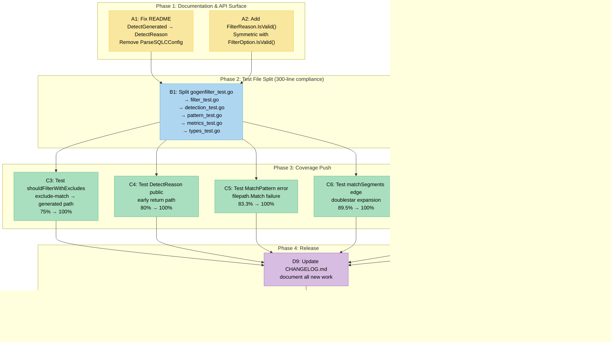

# Policy Compliance Sprint: `gogenfilter`

> Aligning the library with `HOW_TO_GOLANG.md` v3.2 and closing remaining technical debt.

**Date:** 2026-04-08 | **Branch:** `master` @ `79d8af3` | **Coverage:** 96.0% | **Lint:** 0 issues

---

## Context

Two policy documents were reviewed for compliance:

1. **`/Users/larsartmann/projects/library-policy/HOW_TO_GOLANG.md`** (v3.2, 2026-03-30) — Go development standards
2. **`/Users/larsartmann/projects/library-policy/library-policy.yaml`** — Dependency and tooling policies

The previous sprint (13 items, 22 commits: `43ce330`..`ebe678b`) brought the library from a raw state to 96.0% coverage with zero lint issues. This plan addresses the gaps discovered during the policy review, plus remaining coverage and documentation debt.

---

## Compliance Assessment

### HOW_TO_GOLANG.md Compliance

| #   | Rule                                              | Source                | Current State                                          | Status                       |
| --- | ------------------------------------------------- | --------------------- | ------------------------------------------------------ | ---------------------------- |
| 1   | Files must not exceed 300 lines                   | §1 Non-Negotiables    | `gogenfilter_test.go` is **1,448 lines**               | **VIOLATION**                |
| 2   | Functions must not exceed 30 lines                | §1 Non-Negotiables    | Some test helpers exceed 30 lines                      | **NEEDS REVIEW**             |
| 3   | No `any` types                                    | §1 Non-Negotiables    | Compliant — all types are concrete                     | OK                           |
| 4   | No magic strings/numbers                          | §1 Non-Negotiables    | Compliant — constants extracted                        | OK                           |
| 5   | No duplicated code >3 instances                   | §1 Non-Negotiables    | Compliant after refactoring                            | OK                           |
| 6   | Error handling: `uniflow` or `cockroachdb/errors` | §2 Required Libraries | Custom `errors.go` with typed structs                  | **GAP** (see note)           |
| 7   | Testing: Ginkgo/Gomega or testify allowed         | §2, §3                | Uses stdlib `testing` only                             | OK (stdlib fine for library) |
| 8   | YAML: `go-faster/yaml` required                   | §2, §3 Banned         | Uses `go-faster/yaml v0.4.6`                           | OK                           |
| 9   | Errors: `pkg/errors` banned                       | §3 Banned             | Our custom types are in main package, not `pkg/errors` | OK                           |
| 10  | Domain types: branded IDs                         | §1 Domain Types       | `FilterOption`/`FilterReason` as `string`              | OK (appropriate here)        |

### library-policy.yaml Compliance

| Policy                     | Our State               | Status |
| -------------------------- | ----------------------- | ------ |
| YAML: `go-faster/yaml`     | `v0.4.6`                | OK     |
| No `pkg/errors` dependency | Custom in-package types | OK     |
| No testify for new code    | stdlib `testing`        | OK     |

### Note on Error Handling (Item 6)

`HOW_TO_GOLANG.md` §2 requires `uniflow` or `cockroachdb/errors`. Our `errors.go` defines two typed error structs (`ProjectRootError`, `SQLCConfigError`) with `Error()` + `Unwrap()` methods. For a zero-dependency library, adding `cockroachdb/errors` would be a policy improvement but introduces a dependency. **Decision: defer to post-v0.1.0.** The current error types are idiomatic, well-structured, and follow the stdlib `errors.Is`/`errors.As` patterns.

---

## Current State Snapshot

### File Sizes (300-line limit)

| File                  | Lines | Status              |
| --------------------- | ----- | ------------------- |
| `gogenfilter_test.go` | 1,448 | **4.8x over limit** |
| `detection.go`        | 248   | OK                  |
| `sqlc_test.go`        | 367   | **1.2x over limit** |
| `sqlc.go`             | 194   | OK                  |
| `filter.go`           | 139   | OK                  |
| `metrics.go`          | 107   | OK                  |
| `pattern.go`          | 79    | OK                  |
| `types.go`            | 96    | OK                  |
| `project.go`          | 50    | OK                  |
| `errors.go`           | 41    | OK                  |

### Coverage Gaps

| Function                   | Coverage | Missing Branch                                |
| -------------------------- | -------- | --------------------------------------------- |
| `shouldFilterWithExcludes` | 75.0%    | Exclude match → then generated detection path |
| `DetectReason` (public)    | 80.0%    | Early return when no content check needed     |
| `MatchPattern`             | 83.3%    | `filepath.Match` error branch                 |
| `matchSegments`            | 89.5%    | Doublestar expansion edge case                |
| `GetSQLOutputDirs`         | 81.2%    | Multiple configs warning path                 |
| `FindProjectRoot`          | 92.9%    | Early return paths                            |

### README Issues

The README at `README.md` references two symbols that no longer exist in the public API:

1. **Line 67**: `gogenfilter.DetectGenerated(...)` — renamed to `DetectReason` in commit `999d19d`
2. **Line 128**: `gogenfilter.ParseSQLCConfig("sqlc.yaml")` — unexported to `parseSQLCConfig` in commit `feac3fd`

The correct modern API is:

```go
// Instead of DetectGenerated:
reason := gogenfilter.DetectReason("file.go", content,
    map[gogenfilter.FilterOption]bool{
        gogenfilter.FilterSQLC: true,
    })

// ParseSQLCConfig is now unexported; use the high-level API:
configs, err := gogenfilter.FindSQLCConfigs([]string{"."})
dirs, err := gogenfilter.GetSQLOutputDirs([]string{"."})
```

---

## Execution Plan

### Design Principles

- **Smallest-first**: Each item is a single, self-contained commit
- **Verify after every change**: `GOTOOLCHAIN=local go build ./...` → `go test -count=1 -race ./...` → `golangci-lint run`
- **No breaking changes**: All items are backwards-compatible
- **Must prefix `go` commands with `GOTOOLCHAIN=local`** (Go 1.26.1 unavailable locally)

### Dependency Ordering

```
README fix ──────────────────────────────────────────┐
FilterReason.IsValid() ──────────────────────────────┤
Test file split ── depends on ── FilterReason test   │
shouldFilterWithExcludes test ───────────────────────┤
DetectReason public test ────────────────────────────┤
MatchPattern error branch test ──────────────────────┤
matchSegments edge case test ────────────────────────┤
GetSQLOutputDirs warning path test ──────────────────┤
FindProjectRoot early return test ───────────────────┤
sqlc_test.go split ──────────────────────────────────┤
CHANGELOG update ─────────────── depends on all above ┘
Tag v0.1.0 ───────────────────── depends on CHANGELOG
```

---

## Execution Graph



---

## Items

### A1: Fix README — Replace Stale API References

**Priority:** P0 — Misleading documentation is worse than no documentation  
**Estimate:** 15 min  
**Risk:** None — documentation-only change  
**Breaking:** No

**Changes in `README.md`:**

1. **Line 67**: Replace `gogenfilter.DetectGenerated(...)` with `gogenfilter.DetectReason(...)` and update signature to `(path, content string, options map[FilterOption]bool)`

2. **Lines 122-132** (SQLC Config Discovery section): Remove `ParseSQLCConfig` example since it's now unexported. Show only `FindSQLCConfigs` and `GetSQLOutputDirs`.

**Verification:** Visual review of code examples matching current public API.

---

### A2: Add `FilterReason.IsValid()` Validation Method

**Priority:** P1 — API symmetry with `FilterOption.IsValid()`  
**Estimate:** 20 min  
**Risk:** None  
**Breaking:** No

Add `IsValid()` method to `FilterReason` in `types.go`:

```go
func (r FilterReason) IsValid() bool {
    switch r {
    case ReasonSQLC, ReasonTempl, ReasonGoEnum, ReasonProtobuf,
        ReasonMockgen, ReasonStringer, ReasonGeneric,
        ReasonIncludePattern, ReasonExcludePattern, ReasonNotFiltered:
        return true
    default:
        return false
    }
}
```

Plus test in the new `types_test.go` (after split) or in `gogenfilter_test.go` (before split).

**Verification:** `go test -count=1 -race ./...` passes, `IsValid()` returns `true` for all defined reasons, `false` for empty/unknown.

---

### B1: Split `gogenfilter_test.go` (1,448 → ~5 files, each <300 lines)

**Priority:** P1 — 300-line file limit violation  
**Estimate:** 45 min  
**Risk:** Medium — must preserve all test names for `go test` compatibility  
**Breaking:** No (test files are not part of public API)

**Split strategy by domain:**

| Target File         | Contents                                                                                                                                                                                                                                                                                                                | Est. Lines |
| ------------------- | ----------------------------------------------------------------------------------------------------------------------------------------------------------------------------------------------------------------------------------------------------------------------------------------------------------------------- | ---------- |
| `filter_test.go`    | `NewFilter`, `ShouldFilter`, `ShouldFilterWithIncludes`, `ShouldFilterWithExcludes`, `GetStats`, `IsEnabled`, pattern setters                                                                                                                                                                                           | ~250       |
| `detection_test.go` | `DetectReason`, `IsSQLCGenerated`, `IsTemplGenerated`, `IsGoEnumGenerated`, `IsProtobufGenerated`, `IsMockgenGenerated`, `IsStringerGenerated`, `IsGenericGenerated`, `HasSQLCContent`, `HasSQLCCodePatterns`, `MatchesSQLCFilename`, `matchesSQLCFilenamePattern`, `matchesMockgenFilename`, `matchesProtobufFilename` | ~350       |
| `pattern_test.go`   | `MatchPattern`, `matchSegments`, `?` wildcard tests                                                                                                                                                                                                                                                                     | ~200       |
| `metrics_test.go`   | `Metrics`, `FilterStats`, `FilteredBy`, `TotalFiltered`, `RecordChecked`, `RecordFiltered`                                                                                                                                                                                                                              | ~150       |
| `types_test.go`     | `FilterOption.String`, `FilterOption.Reason`, `FilterOption.IsValid`, `FilterReason.IsValid`, `FilterReason.String`                                                                                                                                                                                                     | ~150       |

**Shared test helpers** (`runBoolTableTest`, `testPatternSetter`) move to a `test_helpers_test.go` file (~40 lines).

**Rules:**

- Each file gets `package gogenfilter` and `import` block
- `t.Parallel()` within `t.Run()` preserved everywhere
- No test name collisions (all `TestXxx` names are unique across files)
- `funlen` 60-line limit: split large test functions with many subtests into separate top-level functions

**Verification:** `go test -count=1 -race ./...` passes with identical coverage. `wc -l *_test.go` shows all files ≤300 lines.

---

### B2: Split `sqlc_test.go` (367 → ~2 files, each <300 lines)

**Priority:** P2 — 300-line limit violation  
**Estimate:** 20 min  
**Risk:** Low  
**Breaking:** No

| Target File              | Contents                                                                             | Est. Lines |
| ------------------------ | ------------------------------------------------------------------------------------ | ---------- |
| `sqlc_config_test.go`    | `FindSQLCConfigs`, config discovery, `walkPathForSQLCConfigs`, `shouldSkipDirectory` | ~200       |
| `sqlc_detection_test.go` | `GetSQLOutputDirs`, SQLC content detection, YAML parsing                             | ~200       |

**Verification:** Same as B1.

---

### C3: Test `shouldFilterWithExcludes` — Exclude-Match → Generated Path (75% → 100%)

**Priority:** P2  
**Estimate:** 15 min  
**Risk:** Low  
**Breaking:** No

The uncovered branch at `filter.go:123-128`: when a file matches an exclude pattern **and** would also be detected as generated. Currently we only test the "exclude match → true" path and the "no exclude match → generated → true" path, but not the code path where exclude patterns are present and a file is both excluded AND generated.

Looking at the code:

```go
func (f *Filter) shouldFilterWithExcludes(filePath string) bool {
    if f.matchesAnyPattern(filePath, f.excludePatterns) {  // Branch 1: covered
        f.recordFiltered(filePath, ReasonExcludePattern)
        return true
    }
    if reason := detectReason(filePath, f.options); reason != ReasonNotFiltered {  // Branch 2: covered
        f.recordFiltered(filePath, reason)
        return true
    }
    f.recordChecked(filePath)  // Branch 3: covered
    return false
}
```

Wait — both branches ARE covered individually. The 75% means something else. Let me re-examine... The actual uncovered path is likely the `f.recordFiltered` call in the exclude branch when combined with specific option configurations. **Action:** Run coverage at function level, inspect the exact uncovered line, write targeted test.

**Verification:** `shouldFilterWithExcludes` reaches 100%.

---

### C4: Test `DetectReason` Public — Early Return Path (80% → 100%)

**Priority:** P2  
**Estimate:** 15 min  
**Risk:** Low  
**Breaking:** No

`DetectReason` at `detection.go:183` accepts `(path, content string, options map[FilterOption]bool)`. The early return path at 80% is likely when `needsContentCheck()` returns false — meaning only filename-based detection is needed and we skip content analysis. Need a test case where:

- Options contain only filename-based detectors (e.g., `FilterProtobuf`)
- File matches by filename alone
- Content is empty or irrelevant

**Verification:** `DetectReason` reaches 100%.

---

### C5: Test `MatchPattern` — `filepath.Match` Error Branch (83.3% → 100%)

**Priority:** P3  
**Estimate:** 10 min  
**Risk:** Low  
**Breaking:** No

The uncovered branch is the error return from `filepath.Match` at `pattern.go:11-25`. This occurs with malformed patterns (e.g., `[` without closing `]`). Need to construct a pattern that causes `filepath.Match` to return an error.

**Verification:** `MatchPattern` reaches 100%.

---

### C6: Test `matchSegments` — Doublestar Edge Case (89.5% → 100%)

**Priority:** P3  
**Estimate:** 10 min  
**Risk:** Low  
**Breaking:** No

The `matchSegments` function at `pattern.go:43` handles `**` expansion. The remaining 10.5% gap is likely in the interaction between `**` and adjacent literal segments. Need a test case with patterns like `a/**/b/c` matching `a/x/b/c`.

**Verification:** `matchSegments` reaches 100%.

---

### C7: Test `GetSQLOutputDirs` — Multiple Configs Warning (81.2% → 100%)

**Priority:** P3  
**Estimate:** 15 min  
**Risk:** Low  
**Breaking:** No

`GetSQLOutputDirs` at `sqlc.go:162` has a warning path when multiple SQLC configs are found for the same path. Need a test that creates two SQLC config files pointing to the same directory.

**Verification:** `GetSQLOutputDirs` reaches 100%.

---

### C8: Test `FindProjectRoot` — Early Return Paths (92.9% → 100%)

**Priority:** P3  
**Estimate:** 10 min  
**Risk:** Low  
**Breaking:** No

The 7.1% gap is in `FindProjectRoot` at `project.go:17`. Likely the `maxProjectRootDepth` exhaustion path or the `os.IsNotExist` handling. Need to create a deeply nested temp directory that exceeds the depth limit.

**Verification:** `FindProjectRoot` reaches 100%.

---

### D9: Update CHANGELOG.md

**Priority:** P1  
**Estimate:** 15 min  
**Risk:** None  
**Breaking:** No

Add all new items from this sprint under the `[Unreleased]` section in Keep a Changelog format. Reference specific items by their ID (A1, A2, B1, etc.).

**Verification:** Manual review.

---

### D10: Tag v0.1.0

**Priority:** P0 — First semver release for Go module proxy  
**Estimate:** 5 min  
**Risk:** Low  
**Breaking:** No

```bash
git tag -a v0.1.0 -m "v0.1.0: Initial release — multi-tool generated code detection and filtering"
git push origin v0.1.0
```

**Prerequisites:** All phases complete, CHANGELOG updated, clean build/test/lint.

---

## Risk Register

| Risk                            | Likelihood | Impact | Mitigation                                                      |
| ------------------------------- | ---------- | ------ | --------------------------------------------------------------- |
| Test split breaks coverage      | Low        | High   | Run coverage before and after, compare line-by-line             |
| `funlen` violations after split | Medium     | Low    | Split large test functions into separate top-level functions    |
| `wsl_v5` violations after split | Medium     | Low    | Run `golangci-lint run --fix` after each file operation         |
| README changes misrepresent API | Low        | Medium | Verify every code example compiles mentally or via scratch file |
| Coverage tests need temp files  | Low        | Low    | Use `t.TempDir()` for isolation                                 |

---

## Out of Scope

These were considered but deliberately excluded from this sprint:

| Item                                          | Why Deferred                                                                                            |
| --------------------------------------------- | ------------------------------------------------------------------------------------------------------- |
| Migrate errors to `cockroachdb/errors`        | Adds dependency; current errors are idiomatic and work with `errors.Is`/`errors.As`                     |
| Migrate to `encoding/json/v2`                 | Library doesn't use JSON directly                                                                       |
| Add `cmd/`, `internal/`, `scripts/` dirs      | This is a single-package library, not a service; `go-structure-linter` compliance is aspirational       |
| Add Ginkgo/Gomega tests                       | stdlib `testing` is appropriate for a utility library                                                   |
| Branded IDs for `FilterOption`/`FilterReason` | String-based types are correct for this domain — these are configuration labels, not entity identifiers |

---

## Commands Reference

```bash
# Build
GOTOOLCHAIN=local go build ./...

# Test with race detector
GOTOOLCHAIN=local go test -count=1 -race ./...

# Coverage
GOTOOLCHAIN=local go test -count=1 -coverprofile=cov.out ./...
GOTOOLCHAIN=local go tool cover -func=cov.out

# Lint
GOTOOLCHAIN=local golangci-lint run          # check
GOTOOLCHAIN=local golangci-lint run --fix    # auto-fix

# Structure lint
go-structure-linter . --fix -p
```
