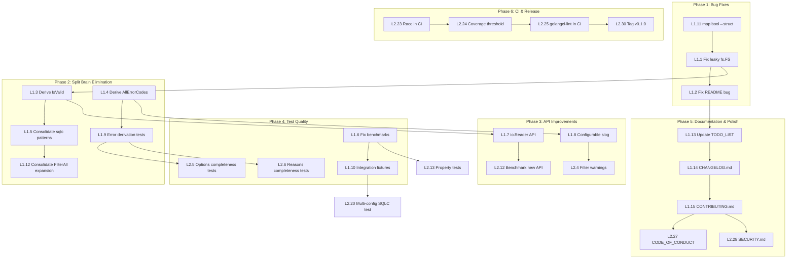

# Brutally Honest Reflection & Execution Plan

**Date:** 2026-04-17  
**Project:** gogenfilter — Go library for detecting/filtering auto-generated code  
**Status:** Pre-v1.0, 97.1% coverage, all tests pass

---

## Part 1: Brutally Honest Reflection

### a) What did we forget?

1. **No `CHANGELOG.md`** — Flagged in TODO_LIST.md but never created. For a library, this is table stakes.
2. **No `CONTRIBUTING.md`** — Also flagged. If anyone else ever contributes, they'll have no guide.
3. **No `io.Reader`-based detection API** — Callers who already have file content in memory (linters, IDE plugins) must pass it as a string to `DetectReason`. A `DetectReasonReader(r io.Reader)` variant would avoid double reads.
4. **No real-world integration tests** — All test content is hand-crafted strings. We never test against actual files generated by sqlc, templ, protobuf, stringer, etc. One tool update could break detection silently.
5. **Package-level godoc is done but TODO_LIST.md says it isn't** — `types.go:1-10` has comprehensive package documentation. The TODO item is stale. We lied by omission.
6. **No versioned examples** — The `example_test.go` examples are basic. No realistic end-to-end usage showing a linter integration.

### b) What is stupid that we do anyway?

1. **`map[FilterOption]bool` as internal option set** (`filter.go:19`) — Values are always `true` and never checked. Should be `map[FilterOption]struct{}`. It's a minor allocation waste and a semantic lie — we never store `false`.

2. **Leaky `fs.FS` abstraction** (`detection.go:299-305`) — `detectReasonFS` falls back from `fs.ReadFile` to `os.ReadFile` when the FS doesn't contain the file. This means a custom `fs.FS` that doesn't have the file will silently read from the real OS filesystem. This undermines the entire abstraction. It's a **real bug**.

3. **Benchmarks use real filesystem I/O** (`bench_test.go:22`) — `filter.ShouldFilter("db/models.go")` with default `os.DirFS(".")` does actual disk reads. Benchmark numbers are unreliable — noise from filesystem caching, disk speed, OS scheduling.

4. **Fragile templ detection** (`detection.go:167`) — `IsTemplGenerated` checks for the literal string `Render(ctx context.Context, w io.Writer) error`. If templ changes its generated signature even slightly, detection breaks silently.

5. **Custom glob matching reinvents the wheel** (`pattern.go`) — 100 lines implementing `**` glob support when `github.com/bmatcuk/doublestar` exists. It works, but it's NIH syndrome. The code is correct but adds maintenance burden.

6. **Half-exported `MetricsMixin`** (`metrics.go:15-18`) — `TotalFilesChecked` is exported but `filteredByReason` is unexported. This is confusing API surface. Either commit to full export or full encapsulation.

### c) What could we have done better?

1. **`IsValid()` methods are manual switches** — `FilterOption.IsValid()` at `types.go:54-63` and `FilterReason.IsValid()` at `types.go:112-123` use hand-written `switch` statements. We already derive `AllFilterOptions()`/`AllFilterReasons()` from the `detectors` table. Not deriving `IsValid()` from the same source is a **split brain** — adding a new option/reason requires updating both the const block AND the switch.

2. **`AllErrorCodes()` is a manual list** (`errors.go:26-36`) — Must be kept in sync with the `const` block above it. Same split brain pattern.

3. **`helpText` map is a manual list** (`errors.go:41-49`) — Third list that must match the error codes. Three things to update when adding an error code.

4. **`slog.Warn` hard-couples library to slog** (`sqlc.go:220`) — Library consumers who don't use slog still get log output. Should be configurable or return warnings through the API.

5. **Error system is over-engineered for the scale** — Branded errors, sentinel errors, `ErrorCoder`/`Helper` interfaces, `CodeEqual[T]` generic, phantom types for error messages. This is a 9-file library with ~1700 lines of production code. The error system alone is ~190 lines. It's well-crafted, but the complexity-to-value ratio is questionable.

### d) What could we still improve?

| Improvement                                                      | Impact                         | Effort  |
| ---------------------------------------------------------------- | ------------------------------ | ------- |
| Derive `IsValid()` from detectors table                          | High (eliminates split brain)  | Low     |
| Derive `AllErrorCodes()`/`helpText` from single source           | High (eliminates split brain)  | Low     |
| Fix leaky `fs.FS` abstraction                                    | High (real bug)                | Low     |
| Replace `map[FilterOption]bool` with `map[FilterOption]struct{}` | Low (correctness)              | Trivial |
| Use `fstest.MapFS` in benchmarks                                 | Medium (reliable perf numbers) | Low     |
| Make slog configurable                                           | Medium (library hygiene)       | Medium  |
| Add `io.Reader` detection API                                    | Medium (real use case)         | Low     |
| Add real-world integration test fixtures                         | High (confidence)              | Medium  |

### e) Did we lie?

**Yes, in small ways:**

1. **TODO_LIST.md claims package-level godoc is unknown priority** — It's done. `types.go:1-10` has it. We didn't mark it complete.
2. **README.md line 173 says `stats.TotalFilesChecked == 1`** — The code processes 3 files (`db/models.go`, `page_templ.go`, `main.go`). Should be `== 3`. This is **wrong documentation** that would confuse users.
3. **97.1% coverage is misleading** — OS-based functions in `sqlc.go` (`FindSQLCConfigs`, `GetSQLOutputDirs`) have no direct tests. Only the `FS` variants are tested. The coverage number hides untested OS integration code.

### f) How can we be less stupid?

1. **Single source of truth for all derived lists** — Options, reasons, error codes, help text, validation — all from one table.
2. **No fallback to OS in `fs.FS` code paths** — If the FS doesn't have it, that's an error or a miss. Don't silently reach around the abstraction.
3. **Benchmarks must be hermetic** — `fstest.MapFS` only. Zero OS I/O.
4. **Integration tests with real tool output** — Check in actual generated files from sqlc, templ, etc.

### g) Ghost systems / split brains

**Ghost systems (underutilized but not dead):**

- `project.go` (`FindProjectRoot`) — One caller: `sqlc.go:190`. Generic enough to be useful elsewhere, but currently orphaned in utility.
- `phantom.go` types `Operation`, `ErrorMessage` — Only used by `sqlc.go` error construction. The type safety they provide is real but the cognitive overhead is disproportionate.

**Split brains (must fix):**

| #   | What                                      | Location A                      | Location B                            |
| --- | ----------------------------------------- | ------------------------------- | ------------------------------------- |
| 1   | `FilterOption.IsValid()`                  | `types.go:54-63` (switch)       | `types.go:66-104` (consts)            |
| 2   | `FilterReason.IsValid()`                  | `types.go:112-123` (switch)     | `types.go:126-141` (consts)           |
| 3   | `AllErrorCodes()`                         | `errors.go:26-36` (manual list) | `errors.go:15-23` (consts)            |
| 4   | `helpText`                                | `errors.go:41-49` (map)         | `errors.go:15-23` (consts)            |
| 5   | `sqlcFilePatterns`/`sqlcCodePatterns`     | `detection.go:61-78` (separate) | `detection.go:115-129` (detector)     |
| 6   | `WithFilterOptions` expanding `FilterAll` | `filter.go:36-48` (inline)      | `detection.go:266-282` (`optionsMap`) |

### h) Scope creep

1. **SQLC config discovery** (`sqlc.go`, 339 lines) — Walking filesystem, parsing YAML, finding project root. This is arguably a separate package or library. For a generated-code _filter_, it's significant scope. Justified by the real use case (sqlc output detection), but the line between "filter" and "config parser" is blurred.

2. **Metrics system** (`metrics.go`, 134 lines) — Thread-safe stats tracking with mutexes, snapshots, string formatting. Well-executed but adds complexity. Justified: linters genuinely need these stats.

3. **Phantom types** (`phantom.go`, 31 lines) — 5 types for API boundary safety. `StartPath` and `ConfigPath` add clear value. `Operation`, `ErrorMessage`, `TotalFilesChecked` add marginal value for the cognitive cost.

### i) Did we remove something useful?

No evidence of regressions. The old string-based `Label` types were removed in earlier sessions and replaced with the current `FilterOption`/`FilterReason` system, which is strictly better.

### j) Split brains — comprehensive list

1. `FilterOption.IsValid()` manual switch vs const block — `types.go:54-63` vs `types.go:66-104`
2. `FilterReason.IsValid()` manual switch vs const block — `types.go:112-123` vs `types.go:126-141`
3. `AllErrorCodes()` manual list vs const block — `errors.go:26-36` vs `errors.go:15-23`
4. `helpText` map vs error code constants — `errors.go:41-49` vs `errors.go:15-23`
5. `sqlcFilePatterns`/`sqlcCodePatterns` separate from sqlc detector — `detection.go:61-78` vs `detection.go:115-129`
6. `WithFilterOptions` expands `FilterAll` inline — `filter.go:36-48` vs `detection.go:266-282` (`optionsMap`)

### k) How are we doing on tests?

**Strengths:**

- 97.1% coverage — strong
- Table-driven tests throughout
- Concurrent test with 100 goroutines
- Property tests with `testing/quick`
- Fuzz tests for pattern matching and detection
- Benchmarks for key functions
- Generic test helpers reduce boilerplate

**Weaknesses:**

- **No tests for OS-based `FindSQLCConfigs`/`GetSQLOutputDirs`** — Only FS variants tested
- **Benchmarks use real filesystem** — Unreliable numbers
- **Property tests are shallow** — `testing/quick` doesn't deeply exercise filter logic
- **No integration tests against real generated files** — All content is hand-crafted
- **No tests for error code derivation** — Would catch `AllErrorCodes()` sync issues
- **`project_test.go` uses temp dirs** — Fine but not fully portable

**Assessment:** Test infrastructure is excellent. Test _coverage_ is strong. Test _depth_ has gaps — we test the API surface thoroughly but don't verify invariants between derived lists or against real-world inputs.

---

## Part 2: Library Assessment

The user listed many libraries. Honest assessment:

| Library            | Relevant? | Why                                                                      |
| ------------------ | --------- | ------------------------------------------------------------------------ |
| gin                | No        | No HTTP server                                                           |
| koanf              | No        | No config loading                                                        |
| templ              | No        | Not generating templates                                                 |
| htmx               | No        | No frontend                                                              |
| go-arch-lint       | Maybe     | Could be a _consumer_ of this library                                    |
| samber/lo          | Marginal  | Could replace `anyMatch` patterns, but adds dependency for marginal gain |
| samber/mo          | No        | No monads needed                                                         |
| samber/do          | No        | No DI needed                                                             |
| sqlc               | Consumer  | sqlc is a _target_ we detect, not a dependency                           |
| ginkgo             | No        | stdlib testing is sufficient                                             |
| charmbracelet/fang | No        | No CLI                                                                   |
| OTEL               | No        | No observability needed in library                                       |
| casbin             | No        | No auth                                                                  |
| resend-go          | No        | No email                                                                 |
| cockroachdb/errors | Marginal  | Could replace custom errors, but our system is small and purpose-built   |

**Conclusion:** This is a small, focused Go library. Almost none of the listed libraries are relevant. The strongest candidates are `samber/lo` (marginal) and `cockroachdb/errors` (marginal). Neither justifies the dependency.

---

## Part 3: Execution Plan

### Level 1 — High-Impact Tasks (30-100 min each)

Sorted by: Impact × Customer Value / Effort

| #     | Task                                                                  | Files                              | Est.  | Impact   | Why                                         |
| ----- | --------------------------------------------------------------------- | ---------------------------------- | ----- | -------- | ------------------------------------------- |
| L1.1  | Fix leaky `fs.FS` abstraction: remove `os.ReadFile` fallback          | `detection.go`                     | 30min | Critical | Real bug — custom FS leaks to OS            |
| L1.2  | Fix README metrics example bug (`TotalFilesChecked == 3`, not `1`)    | `README.md`                        | 12min | High     | Wrong documentation lying to users          |
| L1.3  | Derive `IsValid()` from `AllFilterOptions()`/`AllFilterReasons()`     | `types.go`                         | 45min | High     | Eliminates split brain #1, #2               |
| L1.4  | Derive `AllErrorCodes()` and `helpText` from single source            | `errors.go`                        | 45min | High     | Eliminates split brain #3, #4               |
| L1.5  | Consolidate sqlc patterns into detector struct                        | `detection.go`                     | 30min | Medium   | Eliminates split brain #5                   |
| L1.6  | Fix benchmarks to use `fstest.MapFS`                                  | `bench_test.go`                    | 30min | Medium   | Reliable perf numbers                       |
| L1.7  | Add `io.Reader` detection API (`DetectReasonReader`)                  | `detection.go`                     | 45min | High     | Real use case for linters                   |
| L1.8  | Make slog usage configurable                                          | `sqlc.go`, `filter.go`             | 60min | Medium   | Library hygiene — consumers control logging |
| L1.9  | Add error code derivation tests                                       | `errors_test.go`                   | 30min | High     | Catches sync issues automatically           |
| L1.10 | Add integration test fixtures from real tools                         | `testdata/`, `integration_test.go` | 90min | High     | Confidence against real output              |
| L1.11 | Replace `map[FilterOption]bool` with `map[FilterOption]struct{}`      | `filter.go`                        | 15min | Low      | Correctness — values were never `false`     |
| L1.12 | Consolidate `WithFilterOptions` FilterAll expansion with `optionsMap` | `filter.go`, `detection.go`        | 30min | Medium   | Eliminates split brain #6                   |
| L1.13 | Update TODO_LIST.md: mark completed items                             | `TODO_LIST.md`                     | 12min | Low      | Accuracy                                    |
| L1.14 | Create `CHANGELOG.md`                                                 | `CHANGELOG.md`                     | 30min | High     | Library table stakes                        |
| L1.15 | Create `CONTRIBUTING.md`                                              | `CONTRIBUTING.md`                  | 30min | Medium   | Library table stakes                        |
| L1.16 | Add `codeOwners` / review guidelines                                  | `CONTRIBUTING.md`                  | 15min | Low      | Nice to have                                |

### Level 2 — Smaller Tasks (max 12 min each)

Sorted by: Importance / Effort

| #     | Task                                                                | Files                       | Est.  |
| ----- | ------------------------------------------------------------------- | --------------------------- | ----- |
| L2.1  | Add `FilterOptionAll` and `FilterReasonAll` exported constants      | `types.go`                  | 12min |
| L2.2  | Add `String()` method to `ErrorCode`                                | `errors.go`                 | 8min  |
| L2.3  | Export or unexport `MetricsMixin.filteredByReason` consistently     | `metrics.go`                | 8min  |
| L2.4  | Add `Errors()` method to `Filter` returning accumulated warnings    | `filter.go`                 | 12min |
| L2.5  | Add table-driven tests for `AllFilterOptions()` completeness        | `types_test.go`             | 10min |
| L2.6  | Add table-driven tests for `AllFilterReasons()` completeness        | `types_test.go`             | 10min |
| L2.7  | Add test for `DetectReason` with empty filename                     | `detection_test.go`         | 8min  |
| L2.8  | Add test for `ShouldFilter` with nil FS defaulting to OS            | `filter_test.go`            | 8min  |
| L2.9  | Document the `**` pattern matching syntax in README                 | `README.md`                 | 10min |
| L2.10 | Add `FilterAll` to README quickstart                                | `README.md`                 | 5min  |
| L2.11 | Add `go doc` examples for each `Is*Generated` function              | `example_test.go`           | 12min |
| L2.12 | Benchmark `DetectReasonReader` (new API)                            | `bench_test.go`             | 8min  |
| L2.13 | Add property test: filtering is deterministic                       | `property_test.go`          | 10min |
| L2.14 | Add property test: include+exclude patterns are commutative         | `property_test.go`          | 10min |
| L2.15 | Test concurrent `GetStats()` with `ShouldFilter`                    | `filter_test.go`            | 10min |
| L2.16 | Add `go:generate` command for detector table validation             | `generate.go`               | 12min |
| L2.17 | Verify all exported types have godoc                                | `*.go`                      | 10min |
| L2.18 | Add `//nolint` comments for known false-positive linter warnings    | `detection.go`, `*_test.go` | 8min  |
| L2.19 | Add `.editorconfig` for consistent formatting                       | `.editorconfig`             | 5min  |
| L2.20 | Test SQLC detection with multiple configs in one project            | `sqlc_test.go`              | 10min |
| L2.21 | Add `FilterReason.String()` if not already present                  | `types.go`                  | 5min  |
| L2.22 | Verify `MatchPattern` handles edge cases: empty pattern, single `*` | `pattern_test.go`           | 8min  |
| L2.23 | Add `go test -race` to CI                                           | `.github/workflows/ci.yml`  | 5min  |
| L2.24 | Add coverage threshold to CI (fail below 95%)                       | `.github/workflows/ci.yml`  | 8min  |
| L2.25 | Add `golangci-lint` to CI                                           | `.github/workflows/ci.yml`  | 10min |
| L2.26 | Review and clean up `depguard` allowed-list entries                 | `.golangci.yaml`            | 8min  |
| L2.27 | Add `CODE_OF_CONDUCT.md`                                            | `CODE_OF_CONDUCT.md`        | 5min  |
| L2.28 | Add ` SECURITY.md`                                                  | `SECURITY.md`               | 5min  |
| L2.29 | Verify module path is correct for public publishing                 | `go.mod`                    | 3min  |
| L2.30 | Tag v0.1.0 release                                                  | git                         | 3min  |

---

## Part 4: Execution Graph

---

## Part 5: Execution Order

The actual execution sequence (top to bottom, commit after each):

1. **L1.1** — Fix leaky `fs.FS` (critical bug)
2. **L1.2** — Fix README metrics bug
3. **L1.11** — `map[FilterOption]bool` → `map[FilterOption]struct{}`
4. **L1.3** — Derive `IsValid()` from tables
5. **L1.4** — Derive `AllErrorCodes()`/`helpText` from single source
6. **L1.5** — Consolidate sqlc patterns
7. **L1.12** — Consolidate FilterAll expansion
8. **L1.6** — Fix benchmarks to use MapFS
9. **L1.9** — Add error derivation tests
10. **L1.7** — Add `io.Reader` detection API
11. **L1.8** — Make slog configurable
12. **L1.10** — Add integration test fixtures
13. **L1.13** — Update TODO_LIST.md
14. **L1.14** — Create CHANGELOG.md
15. **L1.15** — Create CONTRIBUTING.md
16. **L2.1–L2.30** — Execute remaining Level 2 tasks in order

---

_Reflection complete. Execution begins now._
