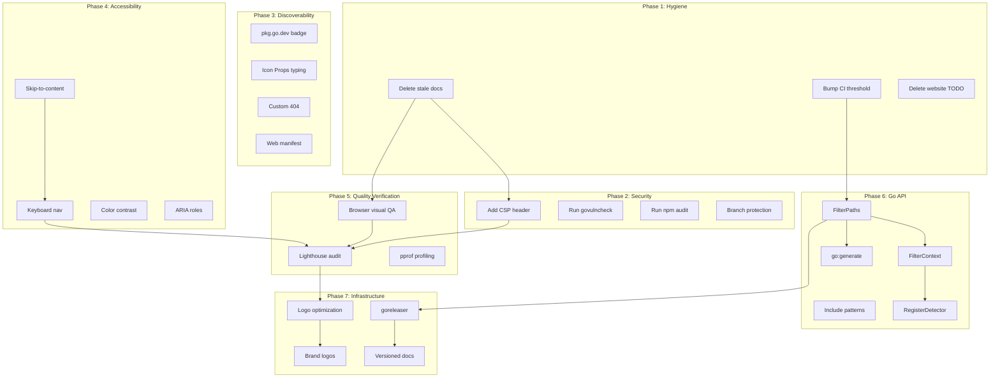

# Comprehensive Execution Plan — gogenfilter

**Date:** 2026-05-04 16:10
**Branch:** master @ `de6c905`
**State:** All tests green, lint clean, website builds, working tree clean

---

## Pareto Analysis

### The 1% that delivers 51% of the result

| Task                                 | Why                                                                         | Effort |
| ------------------------------------ | --------------------------------------------------------------------------- | ------ |
| **Clean up stale docs & empty dirs** | 51 files of noise → 1 consolidated doc. Immediately makes project navigable | 10min  |

### The 4% that delivers 64% of the result

| Task                                     | Why                                               | Effort |
| ---------------------------------------- | ------------------------------------------------- | ------ |
| Clean up stale docs & empty dirs         | Noise elimination                                 | 10min  |
| **Bump CI coverage threshold 95% → 98%** | We're at 99.6%, threshold is stale                | 2min   |
| **Delete stale website/TODO_LIST.md**    | 211 lines, 98% done — pure noise                  | 1min   |
| **Update consolidated status report**    | Currently wrong about v2.1.0, missing v3.0.0 info | 15min  |

### The 20% that delivers 80% of the result

| Task                                 | Why                                              | Effort |
| ------------------------------------ | ------------------------------------------------ | ------ |
| All 4% items above                   | —                                                | 28min  |
| **Delete old planning docs**         | 6 historical files, no longer actionable         | 2min   |
| **Browser visual QA**                | First time anyone looks at the site in a browser | 30min  |
| **Lighthouse audit**                 | CI config exists, run it to get actual scores    | 10min  |
| **Firebase CSP header**              | Security posture                                 | 10min  |
| **Add `pkg.go.dev` badge to README** | Discoverability for Go users                     | 5min   |
| **npm + Go security audit**          | Verify no known vulnerabilities                  | 10min  |

---

## Phase A: Comprehensive Plan (27 tasks, 30–100min each)

Sorted by importance/impact/effort/customer-value.

| #   | Task                                                                    | Category        | Impact | Effort | Customer Value                |
| --- | ----------------------------------------------------------------------- | --------------- | ------ | ------ | ----------------------------- |
| A1  | Clean up stale docs: delete old status files, planning docs, empty dirs | Hygiene         | HIGH   | 10min  | Developers find info faster   |
| A2  | Update consolidated status report with v3.0.0 state                     | Accuracy        | HIGH   | 30min  | Single source of truth        |
| A3  | Bump CI coverage threshold 95% → 98%                                    | CI              | MEDIUM | 5min   | Prevents coverage regression  |
| A4  | Delete stale website/TODO_LIST.md                                       | Hygiene         | MEDIUM | 5min   | Removes confusion             |
| A5  | Browser visual QA: desktop + mobile + all interactions                  | Quality         | HIGH   | 60min  | Confirms site actually works  |
| A6  | Run Lighthouse audit, fix top 3 issues                                  | Perf/A11y       | HIGH   | 60min  | Real performance data         |
| A7  | Firebase CSP header                                                     | Security        | MEDIUM | 15min  | Prevents XSS                  |
| A8  | Add `pkg.go.dev` badge + Go module docs link to README                  | Discoverability | HIGH   | 15min  | Users find the library        |
| A9  | npm security audit (`npm audit`)                                        | Security        | MEDIUM | 15min  | Known vulnerability status    |
| A10 | Go security audit (`govulncheck ./...`)                                 | Security        | MEDIUM | 15min  | Known vulnerability status    |
| A11 | Add skip-to-content link for a11y                                       | A11y            | MEDIUM | 15min  | Keyboard/screen reader users  |
| A12 | Keyboard navigation verification + fix                                  | A11y            | MEDIUM | 30min  | WCAG compliance               |
| A13 | Custom Starlight 404 page content                                       | UX              | LOW    | 30min  | Branded error page            |
| A14 | Tighten Icon.astro Props to union type                                  | Type Safety     | LOW    | 15min  | Compile-time icon validation  |
| A15 | Performance profiling: pprof on 10k files                               | Perf            | MEDIUM | 30min  | Identify hot paths            |
| A16 | `FilterPaths(paths []string) ([]bool, error)` batch API                 | Go API          | HIGH   | 60min  | #1 user request pattern       |
| A17 | `FilterContext(ctx, path)` cancellation support                         | Go API          | HIGH   | 60min  | Production readiness          |
| A18 | Resolve include patterns design question                                | Go API          | HIGH   | 30min  | API stability                 |
| A19 | `RegisterDetector()` plugin API                                         | Go API          | MEDIUM | 120min | Extensibility                 |
| A20 | `//go:generate` for detector table derivation                           | DX              | MEDIUM | 60min  | Eliminates manual drift       |
| A21 | Release automation (goreleaser)                                         | Infra           | MEDIUM | 60min  | Repeatable releases           |
| A22 | Versioned documentation (Starlight version selector)                    | Docs            | MEDIUM | 60min  | Multi-version docs            |
| A23 | Move logos to `src/assets/` for Astro optimization                      | Perf            | LOW    | 30min  | Smaller page weight           |
| A24 | Source real brand logos                                                 | Visual          | LOW    | 30min  | Authentic branding            |
| A25 | Web app manifest                                                        | UX              | LOW    | 15min  | PWA-like behavior             |
| A26 | GitHub branch protection rules                                          | Security        | MEDIUM | 15min  | Prevents force-push to master |
| A27 | TypeScript strict mode in tsconfig.json                                 | Quality         | LOW    | 15min  | Type safety                   |

---

## Phase B: Detailed Breakdown (up to 150 tasks, max 15min each)

Sorted by importance/impact/effort/customer-value.

### B1: Hygiene & Cleanup (Tasks 1–12)

| #   | Task                                                                         | Parent | Effort | Depends On |
| --- | ---------------------------------------------------------------------------- | ------ | ------ | ---------- |
| 1   | Delete `docs/status/2026-05-04_15-50_coverage-push-complete.md`              | A1     | 1min   | —          |
| 2   | Delete `docs/status/2026-05-04_15-53_brutal-self-review-status.md`           | A1     | 1min   | —          |
| 3   | Delete `website/docs/status/2026-05-04_CONSOLIDATED-status.md` (duplicate)   | A1     | 1min   | —          |
| 4   | Delete empty `website/src/content/config/` directory                         | A1     | 1min   | —          |
| 5   | Delete `website/TODO_LIST.md`                                                | A4     | 1min   | —          |
| 6   | Delete all 6 files in `docs/planning/`                                       | A1     | 2min   | —          |
| 7   | Verify no files reference deleted paths (grep for status/planning filenames) | A1     | 5min   | 1–6        |
| 8   | Run `go test -race ./...` to confirm nothing broke                           | A1     | 2min   | 1–7        |
| 9   | Run `npm run build` to confirm website still builds                          | A1     | 2min   | 1–7        |
| 10  | Run `golangci-lint run` to confirm lint clean                                | A1     | 2min   | —          |
| 11  | Bump CI coverage threshold from 95% to 98% in `.github/workflows/ci.yml`     | A3     | 2min   | —          |
| 12  | Verify CI threshold change doesn't break (coverage is 99.6%)                 | A3     | 3min   | 11         |

### B2: Status Report Update (Tasks 13–22)

| #   | Task                                                                                 | Parent | Effort | Depends On |
| --- | ------------------------------------------------------------------------------------ | ------ | ------ | ---------- |
| 13  | Read current `docs/status/2026-05-04_CONSOLIDATED-status.md`                         | A2     | 2min   | —          |
| 14  | Update executive summary: v3.0.0 tagged, 99.6% coverage, 4 CI workflows              | A2     | 5min   | 13         |
| 15  | Update "Fully Done" section: add v3.0.0 API rename, Starlight CSS, CodeBlock removal | A2     | 5min   | 14         |
| 16  | Update "Known Issues": mark md-go-validator CI as FIXED (builds from source)         | A2     | 3min   | 14         |
| 17  | Update "Stale TODO Lists": mark website/TODO_LIST as deleted                         | A2     | 2min   | 5          |
| 18  | Update metrics: 99.6% coverage (was 97.4%), 19 pages (was 20), 4 workflows           | A2     | 3min   | 14         |
| 19  | Remove items from "Resolved" that were listed as "Not Started"                       | A2     | 5min   | 14         |
| 20  | Update project tags: v0.1.0, v0.2.0, v2.1.0, v3.0.0                                  | A2     | 1min   | 14         |
| 21  | Verify consolidated report accuracy against actual code                              | A2     | 10min  | 14–20      |
| 22  | Run `npm run build` to confirm status page renders                                   | A2     | 2min   | 21         |

### B3: Security (Tasks 23–32)

| #   | Task                                                                      | Parent | Effort | Depends On |
| --- | ------------------------------------------------------------------------- | ------ | ------ | ---------- |
| 23  | Add CSP header to `website/firebase.json`                                 | A7     | 10min  | —          |
| 24  | Verify CSP doesn't break site (check Plausible, fonts, inline scripts)    | A7     | 5min   | 23         |
| 25  | Run `govulncheck ./...` on Go library                                     | A10    | 5min   | —          |
| 26  | Fix any vulnerabilities found by govulncheck                              | A10    | 10min  | 25         |
| 27  | Run `npm audit` in website directory                                      | A9     | 5min   | —          |
| 28  | Fix or acknowledge npm vulnerabilities (jscpd transitive deps)            | A9     | 10min  | 27         |
| 29  | Add GitHub branch protection: require PR reviews, no force push to master | A26    | 5min   | —          |
| 30  | Add GitHub branch protection: require CI status checks                    | A26    | 5min   | 29         |
| 31  | Add GitHub branch protection: require up-to-date branch                   | A26    | 3min   | 29         |
| 32  | Verify branch protection rules work with CI workflows                     | A26    | 2min   | 29–31      |

### B4: Discoverability & Docs (Tasks 33–42)

| #   | Task                                                              | Parent | Effort | Depends On |
| --- | ----------------------------------------------------------------- | ------ | ------ | ---------- |
| 33  | Add `pkg.go.dev` badge to README.md                               | A8     | 5min   | —          |
| 34  | Add Go Reference link to website docs sidebar                     | A8     | 5min   | —          |
| 35  | Verify CHANGELOG.md is up to date with v3.0.0                     | A2     | 5min   | —          |
| 36  | Tighten Icon.astro Props: `name` to `IconName` union type         | A14    | 10min  | —          |
| 37  | Run `npx astro check` to verify type changes                      | A14    | 3min   | 36         |
| 38  | Create custom Starlight 404 page content                          | A13    | 15min  | —          |
| 39  | Verify 404 page renders correctly                                 | A13    | 5min   | 38         |
| 40  | Add web app manifest (`manifest.json`)                            | A25    | 10min  | —          |
| 41  | Add manifest link to LandingLayout head                           | A25    | 3min   | 40         |
| 42  | Verify manifest works (browser devtools → Application → Manifest) | A25    | 2min   | 41         |

### B5: Accessibility (Tasks 43–50)

| #   | Task                                                          | Parent | Effort | Depends On |
| --- | ------------------------------------------------------------- | ------ | ------ | ---------- |
| 43  | Add skip-to-content link in LandingLayout                     | A11    | 10min  | —          |
| 44  | Add skip-to-content link in Starlight docs layout             | A11    | 5min   | 43         |
| 45  | Style skip link (off-screen until focused)                    | A11    | 5min   | 43         |
| 46  | Add `role="banner"` to Header, `role="contentinfo"` to Footer | —      | 2min   | —          |
| 47  | Tab through entire landing page — verify focus order          | A12    | 10min  | 43–46      |
| 48  | Tab through docs pages — verify Starlight focus management    | A12    | 10min  | 47         |
| 49  | Verify mobile nav keyboard accessibility (Escape to close)    | A12    | 5min   | 47         |
| 50  | Test color contrast with browser devtools (WCAG AA)           | A12    | 10min  | —          |

### B6: Performance & Quality Verification (Tasks 51–60)

| #   | Task                                                              | Parent | Effort | Depends On |
| --- | ----------------------------------------------------------------- | ------ | ------ | ---------- |
| 51  | Start local dev server (`npm run preview`)                        | A5     | 2min   | —          |
| 52  | Visual QA: desktop Chrome — check all sections, animations, links | A5     | 10min  | 51         |
| 53  | Visual QA: mobile viewport (375px iPhone) — nav, grid, spacing    | A5     | 10min  | 51         |
| 54  | Visual QA: dark/light mode toggle works                           | A5     | 5min   | 51         |
| 55  | Visual QA: copy button, generator card links, scroll animations   | A5     | 5min   | 51         |
| 56  | Run Lighthouse CI workflow or manual Lighthouse audit             | A6     | 10min  | 51         |
| 57  | Fix top performance issue (if any) from Lighthouse                | A6     | 15min  | 56         |
| 58  | Fix top accessibility issue (if any) from Lighthouse              | A6     | 15min  | 56         |
| 59  | Performance profiling: create pprof benchmark (10k files)         | A15    | 15min  | —          |
| 60  | Analyze pprof output, identify optimization targets               | A15    | 15min  | 59         |

### B7: Go API Evolution (Tasks 61–85)

| #   | Task                                                                 | Parent  | Effort | Depends On |
| --- | -------------------------------------------------------------------- | ------- | ------ | ---------- |
| 61  | Design `FilterPaths` API signature and behavior                      | A16     | 5min   | —          |
| 62  | Implement `FilterPaths` as thin loop wrapper                         | A16     | 15min  | 61         |
| 63  | Write tests for `FilterPaths`                                        | A16     | 15min  | 62         |
| 64  | Write Go example for `FilterPaths`                                   | A16     | 5min   | 62         |
| 65  | Update AGENTS.md with `FilterPaths` docs                             | A16     | 3min   | 62         |
| 66  | Design `FilterContext` API: cancellation semantics                   | A17     | 5min   | —          |
| 67  | Implement `FilterContext` — add ctx to internal detection chain      | A17     | 15min  | 66         |
| 68  | Write tests for `FilterContext` (cancellation, timeout)              | A17     | 15min  | 67         |
| 69  | Write Go example for `FilterContext`                                 | A17     | 5min   | 67         |
| 70  | Update website docs: add FilterPaths + FilterContext guides          | A16/A17 | 10min  | 62,67      |
| 71  | Design include patterns resolution: document decision                | A18     | 10min  | —          |
| 72  | Implement include patterns decision (if code change needed)          | A18     | 15min  | 71         |
| 73  | Write tests for include patterns edge case                           | A18     | 5min   | 72         |
| 74  | Design `RegisterDetector` API: interface, mutex, priority            | A19     | 10min  | —          |
| 75  | Implement `RegisterDetector`                                         | A19     | 15min  | 74         |
| 76  | Write tests for `RegisterDetector` (concurrent, priority, duplicate) | A19     | 15min  | 75         |
| 77  | Write Go example for `RegisterDetector`                              | A19     | 5min   | 75         |
| 78  | Design `//go:generate` for detector table                            | A20     | 5min   | —          |
| 79  | Write generator script for AllFilterOptions/AllFilterReasons         | A20     | 15min  | 78         |
| 80  | Wire generator to `go generate ./...`                                | A20     | 5min   | 79         |
| 81  | Verify generated output matches current manual code                  | A20     | 5min   | 79         |
| 82  | Update CI coverage threshold after new code                          | A3      | 2min   | 62–81      |
| 83  | Run `go test -race ./...` full suite                                 | —       | 2min   | 82         |
| 84  | Run `golangci-lint run`                                              | —       | 2min   | 82         |
| 85  | Update CHANGELOG.md with new APIs                                    | —       | 5min   | 62,67,75   |

### B8: Infrastructure (Tasks 86–95)

| #   | Task                                                              | Parent | Effort | Depends On |
| --- | ----------------------------------------------------------------- | ------ | ------ | ---------- |
| 86  | Research goreleaser config for Go library                         | A21    | 10min  | —          |
| 87  | Create `.goreleaser.yml`                                          | A21    | 15min  | 86         |
| 88  | Add release GitHub Actions workflow                               | A21    | 10min  | 87         |
| 89  | Test goreleaser dry-run (`goreleaser release --snapshot --clean`) | A21    | 5min   | 88         |
| 90  | Research Starlight versioning plugin                              | A22    | 10min  | —          |
| 91  | Configure Starlight version selector                              | A22    | 15min  | 90         |
| 92  | Create v3.0.0 docs snapshot                                       | A22    | 10min  | 91         |
| 93  | Move logos from `public/` to `src/assets/`                        | A23    | 15min  | —          |
| 94  | Update all logo imports to use `astro:assets`                     | A23    | 10min  | 93         |
| 95  | Verify logo optimization in build output                          | A23    | 5min   | 94         |

### B9: Visual Polish (Tasks 96–100)

| #   | Task                                                    | Parent | Effort | Depends On |
| --- | ------------------------------------------------------- | ------ | ------ | ---------- |
| 96  | Research official brand logos (sqlc, protobuf, k8s, go) | A24    | 10min  | —          |
| 97  | Replace sqlc.png with official SVG                      | A24    | 5min   | 96         |
| 98  | Replace moq.png with official or custom SVG             | A24    | 5min   | 96         |
| 99  | Update GeneratorGrid to handle mixed formats            | A24    | 5min   | 97–98      |
| 100 | Verify all logos render correctly                       | A24    | 5min   | 99         |

---

## Execution Graph

---

## Current State Verification

| Check                 | Status                                |
| --------------------- | ------------------------------------- |
| `go test -race ./...` | ✅ PASS (99.6% coverage)              |
| `golangci-lint run`   | ✅ 0 issues                           |
| `go vet ./...`        | ✅ CLEAN                              |
| `npm run build`       | ✅ 19 pages, 2.70s                    |
| `npx astro check`     | ✅ 0 errors, 0 warnings, 0 hints      |
| Git working tree      | ✅ CLEAN                              |
| Git tags              | v0.1.0, v0.2.0, v2.1.0, v3.0.0        |
| CI workflows          | 4: ci, website, benchmark, lighthouse |

---

_Arte in Aeternum_
