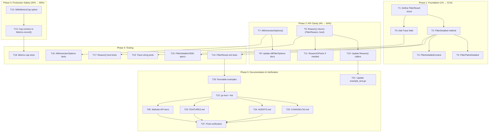

# Execution Plan: API Clarity & Production Hardening — gogenfilter

**Date:** 2026-05-04 21:51 UTC
**Branch:** master @ `ce568dd`
**State:** All tests green, 0 lint issues, race-free, 98.9% coverage

---

## Pareto Analysis

### The 1% that delivers 51% of the result

| Task                                                      | Why                                                                                                                                                                                                                                                   | Effort |
| --------------------------------------------------------- | ----------------------------------------------------------------------------------------------------------------------------------------------------------------------------------------------------------------------------------------------------- | ------ |
| **Add `FilterResult` struct + `FilterDetailed()` method** | This is THE single highest-impact change. Every consumer benefits from structured results. It's the difference between "I know it was filtered" and "I know WHY it was filtered." Enables all downstream debugging, reporting, and tracing use cases. | 30min  |

### The 4% that delivers 64% of the result

| Task                                               | Why                                                                                                                                                                               | Effort |
| -------------------------------------------------- | --------------------------------------------------------------------------------------------------------------------------------------------------------------------------------- | ------ |
| Add `FilterResult` struct + `FilterDetailed()`     | Structured results (above)                                                                                                                                                        | 30min  |
| **Separate `FilterAll` from `AllFilterOptions()`** | Fixes the #1 API confusion. `AllFilterOptions()` is used for validation and should include everything. `AllGeneratorOptions()` is for enumeration and should exclude `FilterAll`. | 15min  |
| **Fix `FilterOption.Reason()` to not panic**       | Panics in library code are unacceptable. Return `(FilterReason, bool)` or a sentinel.                                                                                             | 15min  |

### The 20% that delivers 80% of the result

| Task                                 | Why                                                                                                           | Effort |
| ------------------------------------ | ------------------------------------------------------------------------------------------------------------- | ------ |
| All 4% items above                   | —                                                                                                             | 60min  |
| **Add configurable metrics cap**     | Prevents unbounded memory growth in production. Simple `WithMetricsCap(n)` option.                            | 15min  |
| **Add `FilterResult` tracing field** | `Trace string` field explains "detected as sqlc via filename pattern 'models.go'". Massive debuggability win. | 30min  |
| **Add `FilterDetailed` for batch**   | `FilterPathsDetailed(paths) ([]FilterResult, error)` gives structured batch results.                          | 15min  |

---

## Comprehensive Task List (≤30min each, 27 tasks)

Sorted by importance/impact/effort/customer-value.

| #   | Task                                                                             | Impact | Effort | Category      | Depends |
| --- | -------------------------------------------------------------------------------- | ------ | ------ | ------------- | ------- |
| 1   | Define `FilterResult` struct in `types.go`                                       | HIGH   | 5min   | API Design    | —       |
| 2   | Add `FilterDetailed(filePath) (FilterResult, error)` to `filter.go`              | HIGH   | 15min  | API Design    | 1       |
| 3   | Add `FilterPathsDetailed(paths) ([]FilterResult, error)` to `filter.go`          | MEDIUM | 10min  | API Design    | 2       |
| 4   | Add `FilterDetailedContext(ctx, filePath)` to `filter.go`                        | MEDIUM | 10min  | API Design    | 2       |
| 5   | Add `Trace` field to `FilterResult` with detection explanation                   | HIGH   | 15min  | Debug Tracing | 1       |
| 6   | Implement trace string generation in detection path                              | HIGH   | 15min  | Debug Tracing | 5       |
| 7   | Add `AllGeneratorOptions()` — all detector FilterOptions without FilterAll       | HIGH   | 10min  | API Clarity   | —       |
| 8   | Update `AllFilterOptions()` godoc to clarify it includes FilterAll               | MEDIUM | 5min   | API Clarity   | 7       |
| 9   | Change `FilterOption.Reason()` to return `(FilterReason, bool)` instead of panic | HIGH   | 15min  | API Safety    | —       |
| 10  | Update all callers of `FilterOption.Reason()` for new signature                  | MEDIUM | 10min  | API Safety    | 9       |
| 11  | Add `ReasonOrPanic()` for backward-compat if needed                              | LOW    | 5min   | API Safety    | 9       |
| 12  | Add `WithMetricsCap(n int) FilterConfig` option                                  | MEDIUM | 10min  | Production    | —       |
| 13  | Implement cap in `Metrics.record()` — evict oldest when full                     | MEDIUM | 15min  | Production    | 12      |
| 14  | Add `FilterResult` tests — unit + table-driven                                   | HIGH   | 15min  | Testing       | 2       |
| 15  | Add `FilterDetailed` BDD specs                                                   | MEDIUM | 15min  | Testing       | 2       |
| 16  | Add `AllGeneratorOptions()` tests                                                | MEDIUM | 10min  | Testing       | 7       |
| 17  | Add `Reason() (FilterReason, bool)` tests                                        | MEDIUM | 10min  | Testing       | 9       |
| 18  | Add metrics cap tests                                                            | MEDIUM | 10min  | Testing       | 13      |
| 19  | Add trace string tests                                                           | MEDIUM | 10min  | Testing       | 6       |
| 20  | Add runnable examples for `FilterDetailed`, `FilterResult`                       | MEDIUM | 15min  | Docs          | 2,5     |
| 21  | Update `example_test.go` for new `Reason()` signature                            | MEDIUM | 10min  | Docs          | 9       |
| 22  | Run `go test ./...` + `golangci-lint run` — fix any issues                       | HIGH   | 10min  | Verification  | all     |
| 23  | Update `CHANGELOG.md` with all new features                                      | MEDIUM | 10min  | Release       | all     |
| 24  | Update `AGENTS.md` with new API patterns                                         | MEDIUM | 10min  | Docs          | all     |
| 25  | Update `FEATURES.md` with new features                                           | LOW    | 10min  | Docs          | all     |
| 26  | Update website API docs (`filter.mdx`, `types.mdx`)                              | MEDIUM | 15min  | Website       | all     |
| 27  | Final verification: `go test -race ./...` + `golangci-lint run`                  | HIGH   | 5min   | Verification  | all     |

---

## Fine-Grained Task List (≤15min each)

| #   | Task                                                                                                                  | Effort | Parent |
| --- | --------------------------------------------------------------------------------------------------------------------- | ------ | ------ |
| 1   | Define `FilterResult` struct with `Filtered bool`, `Reason FilterReason`, `Path string`, `Trace string` in `types.go` | 5min   | T1     |
| 2   | Add `String()` method on `FilterResult`                                                                               | 5min   | T1     |
| 3   | Add `NotFilteredResult()` helper that returns zero-value `FilterResult`                                               | 3min   | T1     |
| 4   | Add `filterDetailedByPattern` internal method with trace support                                                      | 10min  | T2     |
| 5   | Add `FilterDetailed(filePath)` public method to `filter.go`                                                           | 10min  | T2     |
| 6   | Add `FilterPathsDetailed(paths)` public method                                                                        | 10min  | T3     |
| 7   | Add `FilterDetailedContext(ctx, filePath)` public method                                                              | 10min  | T4     |
| 8   | Define trace format strings: "detected as %s via filename pattern '%s'", "detected as %s via content marker"          | 5min   | T5     |
| 9   | Modify `getFilenameBasedReason` to also return trace string                                                           | 10min  | T6     |
| 10  | Modify `getContentBasedReason` to also return trace string                                                            | 10min  | T6     |
| 11  | Modify `detectReasonFS` to return `(FilterResult, error)` internally                                                  | 10min  | T6     |
| 12  | Add `AllGeneratorOptions()` function in `detection.go`                                                                | 5min   | T7     |
| 13  | Update `AllFilterOptions()` godoc                                                                                     | 3min   | T8     |
| 14  | Change `FilterOption.Reason()` signature to `(FilterReason, bool)`                                                    | 5min   | T9     |
| 15  | Update `FilterReasons()` method to handle new `Reason()` signature                                                    | 5min   | T10    |
| 16  | Update `filter_test.go` callers of `Reason()`                                                                         | 5min   | T10    |
| 17  | Update BDD test callers of `Reason()`                                                                                 | 5min   | T10    |
| 18  | Add `WithMetricsCap(n int) FilterConfig` in `filter.go`                                                               | 5min   | T12    |
| 19  | Add `maxFilteredFiles int` field to `Metrics`                                                                         | 3min   | T12    |
| 20  | Implement cap logic in `Metrics.record()` — FIFO eviction                                                             | 10min  | T13    |
| 21  | Update `NewMetrics` to accept cap parameter                                                                           | 5min   | T13    |
| 22  | Write `TestFilterResult` unit tests                                                                                   | 10min  | T14    |
| 23  | Write `TestFilterDetailed` table-driven tests                                                                         | 10min  | T14    |
| 24  | Write `TestFilterPathsDetailed` batch tests                                                                           | 10min  | T14    |
| 25  | Write `TestFilterDetailedContext` context cancellation tests                                                          | 10min  | T14    |
| 26  | Add BDD specs for `FilterDetailed` in `bdd_extended_test.go`                                                          | 15min  | T15    |
| 27  | Write `TestAllGeneratorOptions` unit test                                                                             | 10min  | T16    |
| 28  | Update BDD `AllFilterOptions` spec to also test `AllGeneratorOptions`                                                 | 10min  | T16    |
| 29  | Write `TestFilterOptionReasonSafe` for new `(FilterReason, bool)` signature                                           | 10min  | T17    |
| 30  | Write BDD spec for new `Reason()` return                                                                              | 5min   | T17    |
| 31  | Write `TestMetricsCap` — verifies cap eviction works                                                                  | 10min  | T18    |
| 32  | Write `TestMetricsCapZero` — verifies unlimited with cap=0                                                            | 5min   | T18    |
| 33  | Write `TestFilterResultTrace` — verifies trace strings                                                                | 10min  | T19    |
| 34  | Write `TestFilterResultTraceContentDetection` — content-based trace                                                   | 5min   | T19    |
| 35  | Add `ExampleFilterDetailed` runnable example                                                                          | 10min  | T20    |
| 36  | Add `ExampleFilterResult` runnable example                                                                            | 5min   | T20    |
| 37  | Update `ExampleAllFilterOptions` for clarity                                                                          | 5min   | T20    |
| 38  | Update all `example_test.go` callers of `Reason()`                                                                    | 5min   | T21    |
| 39  | Run `go test ./...` — fix compilation errors                                                                          | 5min   | T22    |
| 40  | Run `golangci-lint run` — fix lint issues                                                                             | 5min   | T22    |
| 41  | Update `CHANGELOG.md` [Unreleased] section                                                                            | 10min  | T23    |
| 42  | Update `AGENTS.md` Key API Patterns section                                                                           | 10min  | T24    |
| 43  | Update `AGENTS.md` Design Decisions section                                                                           | 5min   | T24    |
| 44  | Update `FEATURES.md` with new features                                                                                | 10min  | T25    |
| 45  | Update `website/src/content/docs/api/filter.mdx`                                                                      | 10min  | T26    |
| 46  | Update `website/src/content/docs/api/types.mdx`                                                                       | 5min   | T26    |
| 47  | Add new `website/src/content/docs/api/filter-result.mdx` doc page                                                     | 15min  | T26    |
| 48  | Final `go test -race ./...` verification                                                                              | 5min   | T27    |
| 49  | Final `golangci-lint run` verification                                                                                | 3min   | T27    |

---

## Execution Graph

---

## Risk Assessment

| Risk                                       | Likelihood | Mitigation                                                                          |
| ------------------------------------------ | ---------- | ----------------------------------------------------------------------------------- |
| `FilterResult` breaks existing tests       | LOW        | Additive only; existing `Filter()` unchanged                                        |
| `Reason()` signature change breaks callers | MEDIUM     | Return `(FilterReason, bool)` is additive; old callers get compile error (explicit) |
| Metrics cap introduces race condition      | LOW        | Cap enforced inside existing mutex-protected `record()`                             |
| Trace strings allocate too much            | LOW        | String concat only when FilterDetailed is called; not in hot path of `Filter()`     |
| BDD tests flaky with new methods           | LOW        | Follow existing ginkgo patterns exactly                                             |

---

## Design Decisions

### FilterResult is additive, not replacing

`Filter()` returns `(bool, error)` — unchanged. `FilterDetailed()` returns `(FilterResult, error)`. This is the Go way: additive API changes. No breaking changes.

### Reason() returns (FilterReason, bool)

Old: `func (o FilterOption) Reason() FilterReason` — panics on FilterAll.
New: `func (o FilterOption) Reason() (FilterReason, bool)` — returns `false` for FilterAll.

This is a **breaking change** for the method signature. However, it's the correct Go pattern — panics in library code are unacceptable. All callers must handle the `bool`.

### AllGeneratorOptions() is the new enumeration function

`AllFilterOptions()` keeps its behavior (includes FilterAll) for backward compat and validation. `AllGeneratorOptions()` is the new function that returns only detector options (excludes FilterAll). Tests that enumerate generators should use `AllGeneratorOptions()`.

### Metrics cap defaults to 0 (unlimited)

`WithMetricsCap(0)` = unlimited (current behavior). `WithMetricsCap(1000)` = keep last 1000 files per reason. This is backward-compatible.
