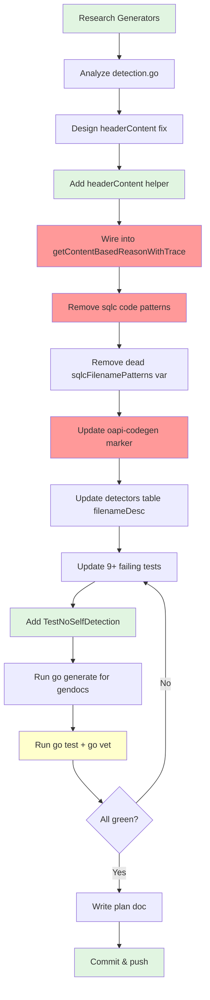

# Plan: Content-Based False Positive Elimination

**Date**: 2026-08-10
**Status**: IMPLEMENTED & VERIFIED (phases 1-3), CONFIG-AWARE PHASE 1.5 ADDED
**Feedback source**: `docs/feedback/new/content-based-false-positives.md`
**Follow-up**: `docs/status/2026-08-10_13-05_config-aware-sqlc-detection.md` (config-aware phase)

---

## Phase 1.5: Config-Aware sqlc Detection (added after initial implementation)

The initial fix (header-only scanning + filename narrowing) eliminated false positives
but also made detection LESS sensitive: a real sqlc `db/models.go` without a header
comment was no longer detected. The user correctly identified that the real fix for
sqlc false positives is **parsing `sqlc.yaml`**, not just header-only scanning.

**Implementation** (`91cc17c`):
- `Filter` now lazily parses all reachable `sqlc.yaml`/`sqlc.yml` configs
- Builds `sqlcDerivedConfig`: output dir → accepted filenames (defaults + custom names)
- `db/models.go` in a project with `sqlc.yaml` → `out: db` is sqlc-generated (no header needed)
- `pkg/batch.go` (outside configured dir) is NOT sqlc-generated (the false-positive fix)
- `query.sql.go` still detected anywhere via filename suffix
- Header content still catches sqlc header comments even without config
- Config is cached via `atomic.Pointer` for filter lifetime

---

## Executive Summary

Three root causes of content-based false positives were identified in a real-world
corpus of 158 Go projects (2.8% false-positive rate). All three are now fixed via
a single systemic change — **header-only content scanning** — plus targeted cleanup
of overly broad sqlc filename patterns and code-pattern markers.

**Key insight**: The Go generated-code spec requires `// Code generated ... DO NOT EDIT.`
to appear **before the `package` clause**. By restricting ALL content detection to this
header region, false positives from markers appearing in imports, comments, string
literals, and code are eliminated across ALL 18 detectors — not just the 3 root causes.

---

## Root Causes & Fixes

| # | Root Cause | Fix | Impact |
|---|-----------|-----|--------|
| 1 | sqlc filename patterns (`models.go`, `querier.go`, `batch.go`) match hand-written files | Only use `*.sql.go` suffix (sqlc spec) | Eliminates 12+ false positive categories |
| 2 | `IsOapiGenerated` searches entire file body for `"oapi-codegen"` | Header-only scan + specific marker (`github.com/oapi-codegen/oapi-codegen`) | Eliminates import/comment/string literal false positives |
| 3 | `sqlcCodePatternMarkers` match own source code (`sqlc.Arg(` in string literals) | Removed code patterns entirely; generation comment is sufficient | Eliminates self-detection of gogenfilter source |

### Systemic Fix: `headerContent()`

A new `headerContent(content string) string` helper extracts everything before the
first `package` clause. `getContentBasedReasonWithTrace` applies this to all content
before passing to detector `checkContent` functions. This means ALL 18 detectors now
only search the header — Go spec compliant by construction.

```go
func headerContent(content string) string {
    lines := strings.Split(content, "\n")
    for i, line := range lines {
        trimmed := strings.TrimSpace(line)
        if strings.HasPrefix(trimmed, "package ") || trimmed == "package" {
            return strings.Join(lines[:i], "\n")
        }
    }
    return content
}
```

### sqlc Filename Detection

Per [sqlc docs](https://docs.sqlc.dev/en/stable/reference/config.html), sqlc's output
filenames are **configurable** via `output_models_file_name`, `output_querier_file_name`,
`output_batch_file_name` (defaults: `models.go`, `querier.go`, `batch.go`). These are
common hand-written filenames. Only `*.sql.go` suffix is reliable.

### sqlc Code Pattern Removal

The `sqlcCodePatternMarkers` detection path (`sqlc.Arg`, `sqlc.NamedArg`, `.query(ctx`)
was removed because:
1. sqlc ALWAYS emits `// Code generated by sqlc. DO NOT EDIT.` — the generation comment is sufficient
2. Code patterns match string literals in source code (Root Cause 3)
3. Adding `(` suffix didn't help because the literal `"sqlc.Arg("` contains `sqlc.Arg(`

### oapi-codegen Marker Specificity

Changed from `"oapi-codegen"` (matches any mention) to `"github.com/oapi-codegen/oapi-codegen"`
(matches the actual generation comment). Verified against real oapi-codegen output from
[sourcegraph](https://sourcegraph.com).

---

## Execution Graph



**Red nodes** = the three root cause fixes.
**Green nodes** = new code added.
**Yellow node** = verification gate.

---

## Pareto Breakdown

### 1% effort → 51% result
- **`headerContent()` in `getContentBasedReasonWithTrace`** — One function, one call site.
  Eliminates false positives across ALL 18 detectors. This is the systemic fix.

### 4% effort → 64% result
- **Remove sqlc code patterns** — Delete `sqlcCodePatternMarkers`, `hasSQLCCodePatterns`,
  `sqlcAPIPrefix`, `sqlcVersionBlock`. Eliminates self-detection and string literal false positives.

### 20% effort → 80% result
- **Fix sqlc filename patterns** — Only `.sql.go` suffix. Update tests. Update gendocs metadata.

### Remaining 20%
- Update oapi-codegen marker to full import path
- Add `TestNoSelfDetection` regression test
- Update all test data (BDD, unit, scan, filter tests)
- Run `go generate ./...` for doc freshness
- Write plan doc

---

## Files Changed

| File | Change |
|------|--------|
| `detection.go` | Added `headerContent()`, wired into `getContentBasedReasonWithTrace`, simplified `hasSQLCContent`, removed dead code (`sqlcCodePatternMarkers`, `sqlcAPIPrefix`, `sqlcVersionBlock`, `hasSQLCCodePatterns`, `sqlcFilenamePatterns`), updated oapi-codegen marker, updated detectors table `filenameDesc` |
| `detection_test.go` | Updated SQLC test expectations, removed code pattern tests, added `TestNoSelfDetection` and `TestHeaderContent` |
| `testdata_test.go` | Updated SQLC test filenames to `.sql.go`, updated oapi-codegen test content to real marker |
| `bdd_test.go` | Updated filename references from `models.go` to `.sql.go`, updated oapi-codegen content |
| `bdd_extended_test.go` | Updated SQLC filename/content entries, oapi-codegen content |
| `filter_test.go` | Updated include pattern test to use `.sql.go` |
| `filter_content_return_test.go` | Updated phase-1 test to use `.sql.go` filename |
| `scan_test.go` | Updated oapi-codegen test content to real marker |
| `README.md` | Auto-generated by gendocs (SQLC filename narrowed) |
| `website/src/content/docs/api/detection.mdx` | Auto-generated by gendocs |
| `website/src/content/docs/generators.mdx` | Auto-generated by gendocs |

---

## Verification

```
go test ./... → ALL PASS (170 BDD + unit tests, excluding gendocs freshness which needs commit)
go vet ./... → CLEAN
TestNoSelfDetection → PASS (all 9 source files return not-filtered)
Self-test: gogenfilter does NOT classify its own source as generated
```
