# Pareto Execution Plan — gogenfilter v3.4.0+

> **Date:** 2026-08-10 16:45 CEST
> **Source:** `TODO_LIST.md` (21 items) + docs-health status report (50 next items)
> **Total open items:** 21 in TODO_LIST + 12 additional from status report = **33 items**

---

## 1. Pareto Breakdown

### The 1% that delivers 51%

**One decision: Is v3 in maintenance mode or is there a v4?**

This single strategic choice reframes every other task. If v3 is done, then the TODO list is a maintenance checklist. If v4 is greenlit, the golangci-lint plugin becomes the north star and most polish items become prerequisites. Everything else is busywork until this is answered.

| Item | Why it's 1% | Effort |
|------|-------------|--------|
| Define v3 maintenance vs v4 vision | Determines whether the project ships a golangci-lint plugin (highest community value) or enters bugfix-only mode. Every other task's priority depends on this answer. | Decision (user) |

### The 4% that delivers 64%

**Close the multi-session deferral loops.** Three items have been deferred 5+ sessions across every status report. They are small, bounded, and embarrassing. Closing them eliminates the most persistent technical debt and frees mental bandwidth.

| # | Item | Impact | Effort | Why |
|---|------|--------|--------|-----|
| 1 | Gendocs cleanup triad (makezero + formatMarkdownTable tests + AGENTS.md entry) | HIGH | 50 min | 5+ session deferral, single point of failure in docs pipeline, zero dedicated tests on load-bearing function |
| 2 | API polish triad (doc.go Quick Start + mainProgram fix + feedback lifecycle) | HIGH | 25 min | Makes v3.4.0 feel complete; pkg.go.dev users can't see FilterDetailedAndContent; flake.nix lies about mainProgram |
| 3 | Fix stale CHANGELOG claim about website API docs | MEDIUM | 15 min | v3.2.0/v3.3.0 entries claim Filter method API pages exist; they were deleted and replaced with pkg.go.dev |

**Total: 90 min. Closes 3 multi-session loops + completes v3.4.0 release polish.**

### The 20% that delivers 80%

**Make the CI green and the project trustworthy.** A red X on every release tells every visitor "this project is broken." The website has never been visually verified. Supply-chain security is unpinned.

| # | Item | Impact | Effort | Why |
|---|------|--------|--------|-----|
| 4 | Fix or disable Lighthouse CI | HIGH | 90 min | Red X on every push. Either fix a11y issues or suppress assertions until fixed. |
| 5 | Visually verify website | HIGH | 60 min | No session has ever rendered a pixel. Complete blind spot. |
| 6 | Pin GitHub Actions to SHA hashes | MEDIUM | 60 min | 29 unpinned actions across 5 workflows. Supply-chain attack surface. |
| 7 | Fix BuildFlow pre-commit hook | MEDIUM | 30 min | Excludes JS/TS tools from Go library config. Currently forces `--no-verify` on every commit. |
| 8 | Add pre-release checklist to RELEASING.md | MEDIUM | 30 min | "All CI green at tagged commit?" + "Commit message follows convention?" Prevents broken-tag releases. |
| 9 | BDD specs for content-return APIs | MEDIUM | 30 min | ~120 Ginkgo specs cover main API but not content-return variants. Coverage gap grows with each API. |
| 10 | Annotate 7 Aug-10 status reports | MEDIUM | 45 min | Same treatment as Aug-05 reports. Open items need harvesting. |

**Total: ~7 hr. Makes CI trustworthy, website verified, supply chain hardened.**

### The remaining 20% (to reach 100%)

Everything else is polish, infrastructure, or external:

| # | Item | Impact | Effort | Blocker |
|---|------|--------|--------|---------|
| 11 | Evaluate golangci-lint plugin opportunity | MEDIUM | 60 min | Depends on v3-vs-v4 decision |
| 12 | Website performance audit | MEDIUM | 60 min | Needs Lighthouse |
| 13 | Test on real browsers | MEDIUM | 30 min | Needs browsers |
| 14 | Design custom detector registration API | LOW | 60 min | Depends on v4 decision |
| 15 | Resolve art-dupl upstream breakage | LOW | 60 min+ | External repo |
| 16 | Migrate to Go 1.27 | LOW | 120 min | Toolchain assessment |
| 17 | Audit npm overrides | LOW | 10 min | None |
| 18 | Lighthouse CI gate-vs-monitor policy | MEDIUM | 30 min | Needs GitHub App token |
| 19 | Prune GCP service account keys | LOW | 30 min | Needs gcloud auth |
| 20 | Create api/filter.mdx website page | LOW | 45 min | None |
| 21 | Add FilterDetailedAndContent benchmark | LOW | 30 min | None |
| 22 | Write ADR for FilterDetailedAndContent | LOW | 30 min | None |
| 23 | Update art-dupl consumer (separate repo) | LOW | 60 min | External repo |
| 24 | Add CODE_OF_CONDUCT.md | LOW | 10 min | None |
| 25 | Investigate unifying theme systems | LOW | 60 min | Accepted trade-off |
| 26 | Verify pkg.go.dev + go install for v3.4.0 | LOW | 15 min | Network access |
| 27 | Fix gomod-check (direct/indirect mixed) | LOW | 10 min | None |
| 28 | Extract vendorHash to vendorHash.nix | LOW | 15 min | None |
| 29 | Add flake.nix meta homepage/platforms | LOW | 5 min | None |

---

## 2. Comprehensive Plan (Medium Granularity — 30-100 min tasks)

Sorted by importance / impact / effort / customer-value.

| # | Task | Pareto | Impact | Effort | Blocked? | Dependencies |
|---|------|--------|--------|--------|----------|--------------|
| M1 | **Strategic decision prep: v3 maintenance vs v4** — Write recommendation document for user | 1% | CRITICAL | 60 min | User decision | None |
| M2 | **Gendocs cleanup triad** — makezero revert + formatMarkdownTable tests + AGENTS.md design decision | 4% | HIGH | 50 min | No | None |
| M3 | **API polish triad** — doc.go Quick Start + flake.nix mainProgram fix + docs/feedback lifecycle | 4% | HIGH | 25 min | No | None |
| M4 | **Fix stale CHANGELOG claims** — v3.2.0/v3.3.0 entries reference deleted API pages | 4% | MEDIUM | 15 min | No | None |
| M5 | **Fix or disable Lighthouse CI** — stop red X on every release | 20% | HIGH | 90 min | Needs investigation | None |
| M6 | **Visually verify website** — screenshots, both themes, mobile | 20% | HIGH | 60 min | Needs browser | None |
| M7 | **Pin GitHub Actions to SHA hashes** — 29 actions across 5 workflows | 20% | MEDIUM | 60 min | No | None |
| M8 | **Fix BuildFlow pre-commit hook** — exclude JS/TS tools from Go library config | 20% | MEDIUM | 30 min | No | None |
| M9 | **Add pre-release checklist to RELEASING.md** — CI-green-at-tag + commit convention check | 20% | MEDIUM | 30 min | No | None |
| M10 | **BDD specs for content-return APIs** — FilterWithContent, FilterDetailedWithContent, FilterDetailedAndContent | 20% | MEDIUM | 30 min | No | None |
| M11 | **Annotate + harvest 7 Aug-10 status reports** — inline strikethrough + TODO_LIST extraction | 20% | MEDIUM | 45 min | No | None |
| M12 | **Audit npm overrides** — check if brace-expansion, devalue, vite, yaml overrides still needed | 80% | LOW | 10 min | No | None |
| M13 | **Verify pkg.go.dev + go install v3.4.0** — post-release verification | 80% | LOW | 15 min | Network | None |
| M14 | **Fix gomod-check + flake.nix meta** — direct/indirect mixed + homepage/platforms attrs | 80% | LOW | 15 min | No | None |
| M15 | **Extract vendorHash to vendorHash.nix** — cleaner diffs for dep updates | 80% | LOW | 15 min | No | None |
| M16 | **Add CODE_OF_CONDUCT.md** — community health file | 80% | LOW | 10 min | No | None |
| M17 | **Add FilterDetailedAndContent benchmark** — dedicated bench in bench_test.go | 80% | LOW | 30 min | No | None |
| M18 | **Create api/filter.mdx** — website API reference for Filter type methods | 80% | LOW | 45 min | No | None |
| M19 | **Write ADR for FilterDetailedAndContent** — inline-both-patterns design decision | 80% | LOW | 30 min | No | None |
| M20 | **Evaluate golangci-lint plugin** — feasibility + community interest research | 80% | MEDIUM | 60 min | Depends on M1 | M1 |
| M21 | **Website performance audit** — Lighthouse baselines post-redesign | 80% | MEDIUM | 60 min | Needs Lighthouse | M5 |
| M22 | **Test on real browsers** — Chrome, Firefox, Safari cross-browser | 80% | MEDIUM | 30 min | Needs browsers | M6 |
| M23 | **Lighthouse CI gate-vs-monitor** — configure LHCI_GITHUB_APP_TOKEN | 80% | MEDIUM | 30 min | GitHub App | M5 |
| M24 | **Resolve art-dupl upstream** — fix v0.3.0 compile error or replace dedup tool | 80% | LOW | 60 min+ | External repo | None |
| M25 | **Migrate to Go 1.27** — drop GOEXPERIMENT=jsonv2 | 80% | LOW | 120 min | Toolchain | None |
| M26 | **Prune GCP service account keys** — max-2-active-keys policy | 80% | LOW | 30 min | gcloud auth | None |
| M27 | **Update art-dupl consumer** — migrate shouldIncludeFile to FilterDetailedAndContent | 80% | LOW | 60 min | External repo | None |

**Totals:** 27 tasks, ~19 hr 15 min estimated effort.
- **Unblocked now:** M1-M4, M7-M12, M14-M19, M24-M25 = 18 tasks (~12 hr)
- **Blocked by decision:** M20-M21 (depend on M1 or M5)
- **Blocked by external:** M6, M13, M22-M23, M24, M26-M27

---

## 3. Detailed Breakdown (Fine Granularity — max 12 min each)

Each medium task decomposed into subtasks that fit in a single focused sprint.

### M1: Strategic decision prep (60 min → 5 subtasks)

| # | Subtask | Effort |
|---|---------|--------|
| F1 | Read ROADMAP.md, FEATURES.md, TODO_LIST.md, recent status reports for strategic context | 10 min |
| F2 | Research golangci-lint plugin API (go/analysis interface, plugin registration) | 12 min |
| F3 | Research community interest (GitHub issues, golangci-lint repo, ecosystem gaps) | 12 min |
| F4 | Write recommendation document: v3 maintenance pros/cons vs v4 plugin pros/cons | 12 min |
| F5 | Present recommendation to user with clear options | 4 min |

### M2: Gendocs cleanup triad (50 min → 5 subtasks)

| # | Subtask | Effort |
|---|---------|--------|
| F6 | Read `formatMarkdownTable` (`cmd/gendocs/main.go:413-460`) and understand current behavior | 8 min |
| F7 | Revert makezero cargo-cult: `make([]T, 0, n) + append` → `make([]T, n) + //nolint:makezero` at lines 420, 436, 448 | 8 min |
| F8 | Write `TestFormatMarkdownTable` — alignment, separator, empty input, single column, pipe escaping | 12 min |
| F9 | Run `nix run .#test` and `nix run .#lint` to verify | 5 min |
| F10 | Update AGENTS.md gendocs section with `formatMarkdownTable` design decision | 10 min |

### M3: API polish triad (25 min → 3 subtasks)

| # | Subtask | Effort |
|---|---------|--------|
| F11 | Add `FilterDetailedAndContent` code example to `doc.go` Quick Start section | 10 min |
| F12 | Fix `flake.nix` `mainProgram = "gogenfilter"` → remove or change to `gendocs` | 5 min |
| F13 | Create `docs/feedback/processed/` and move 2 implemented feedback files | 10 min |

### M4: Fix stale CHANGELOG claims (15 min → 2 subtasks)

| # | Subtask | Effort |
|---|---------|--------|
| F14 | Find stale "Website API docs for FilterWithContent" entries in CHANGELOG.md v3.2.0/v3.3.0 sections | 5 min |
| F15 | Correct entries: mark as "replaced by pkg.go.dev" in both CHANGELOG.md and changelog.mdx | 10 min |

### M5: Fix or disable Lighthouse CI (90 min → 8 subtasks)

| # | Subtask | Effort |
|---|---------|--------|
| F16 | Read `.github/workflows/lighthouse.yml` and `lighthouserc.json` | 5 min |
| F17 | Run Lighthouse locally on the website (`cd website && npm run build && npx lighthouse ...`) | 12 min |
| F18 | Identify specific a11y failures: `color-contrast`, `label-content-name-mismatch`, `redirects` | 10 min |
| F19 | If fixable: fix CSS/component issues in website source | 12 min |
| F20 | If not fixable now: downgrade assertions from `error` to `warn` in `lighthouserc.json` | 5 min |
| F21 | Add comment to workflow explaining the advisory-only policy | 5 min |
| F22 | Verify CI passes on next push (or simulate) | 10 min |
| F23 | Document decision in AGENTS.md CI section | 8 min |

### M6: Visually verify website (60 min → 5 subtasks)

| # | Subtask | Effort |
|---|---------|--------|
| F24 | `cd website && npm run dev` — start local dev server | 5 min |
| F25 | Screenshot landing page: dark theme, light theme, mobile viewport | 10 min |
| F26 | Screenshot docs pages: generators, detection, quick-start, changelog | 12 min |
| F27 | Check colors, gradients, syntax highlighting (dracula theme), OG images, logo | 12 min |
| F28 | Document findings: broken layouts, contrast issues, missing images | 10 min |

### M7: Pin GitHub Actions to SHA hashes (60 min → 5 subtasks)

| # | Subtask | Effort |
|---|---------|--------|
| F29 | List all `uses:` statements across `.github/workflows/*.yml` | 5 min |
| F30 | For each action, find the SHA for the current tag version | 12 min |
| F31 | Replace `@vN` with `@<sha>` in ci.yml (12 actions) | 12 min |
| F32 | Replace `@vN` with `@<sha>` in benchmark.yml, website.yml, lighthouse.yml, release.yml (17 actions) | 12 min |
| F33 | Verify workflows parse with `actionlint` or manual review | 10 min |

### M8: Fix BuildFlow pre-commit hook (30 min → 3 subtasks)

| # | Subtask | Effort |
|---|---------|--------|
| F34 | Read `.buildflow.yml` and identify JS/TS tool steps that fail (dprint, tailwindcss, biome, jest, vitest) | 8 min |
| F35 | Add exclude rules for JS/TS tools in `.buildflow.yml` | 12 min |
| F36 | Test: make a trivial commit and verify BuildFlow passes without `--no-verify` | 10 min |

### M9: Add pre-release checklist to RELEASING.md (30 min → 3 subtasks)

| # | Subtask | Effort |
|---|---------|--------|
| F37 | Read current RELEASING.md steps | 5 min |
| F38 | Add pre-release checklist: "All CI green at tagged commit?", "Commit message follows `release:` convention?", "astro check passes?" | 12 min |
| F39 | Add BuildFlow interaction note: "BuildFlow may auto-commit release prep; ensure final commit uses correct message" | 10 min |

### M10: BDD specs for content-return APIs (30 min → 3 subtasks)

| # | Subtask | Effort |
|---|---------|--------|
| F40 | Read existing BDD specs in `bdd_test.go` and `bdd_extended_test.go` for patterns | 8 min |
| F41 | Write `DescribeTable` for `FilterWithContent`, `FilterDetailedWithContent`, `FilterDetailedAndContent` | 12 min |
| F42 | Run `nix run .#test` to verify specs pass | 5 min |

### M11: Annotate + harvest Aug-10 status reports (45 min → 4 subtasks)

| # | Subtask | Effort |
|---|---------|--------|
| F43 | Read 7 Aug-10 status reports, extract open items | 12 min |
| F44 | Resolve numbered items inline (strikethrough + commit hashes) | 12 min |
| F45 | Harvest open items into TODO_LIST/ROADMAP | 12 min |
| F46 | Archive fully-resolved reports to `docs/status/archive/` | 5 min |

### M12-M19: Quick tasks (8 tasks, ~3 hr total)

| # | Subtask | Effort |
|---|---------|--------|
| F47 | M12: Audit npm overrides — check each against latest Dependabot alerts | 10 min |
| F48 | M13: Verify pkg.go.dev shows v3.4.0 + test `go install` | 12 min |
| F49 | M14: Fix gomod-check (split direct/indirect in go.mod) + add flake.nix meta attrs | 12 min |
| F50 | M15: Extract vendorHash to `vendorHash.nix` files (root + website) | 12 min |
| F51 | M16: Add CODE_OF_CONDUCT.md (Contributor Covenant) | 10 min |
| F52 | M17: Write `BenchmarkFilterDetailedAndContent` in `bench_test.go` | 12 min |
| F53 | M18: Create `website/src/content/docs/api/filter.mdx` | 12 min |
| F54 | M19: Write ADR `docs/adr/002-filter-detailed-and-content.md` | 12 min |

### M20-M27: Blocked/external tasks (8 tasks, ~6 hr)

| # | Subtask | Effort | Blocker |
|---|---------|--------|---------|
| F55 | M20: Research golangci-lint plugin feasibility (go/analysis, plugin loading) | 12 min | M1 |
| F56 | M20: Research community interest (GitHub issues, discussions) | 12 min | M1 |
| F57 | M21: Run Lighthouse performance audit on built website | 12 min | M5 |
| F58 | M22: Test website in Chrome/Firefox/Safari | 12 min | M6 |
| F59 | M23: Configure LHCI_GITHUB_APP_TOKEN (install GitHub App, add secret) | 12 min | GitHub App |
| F60 | M24: Investigate art-dupl v0.3.0 compile error | 12 min | External repo |
| F61 | M25: Assess Go 1.27 migration impact on CI/Nix | 12 min | Toolchain |
| F62 | M26: Audit + prune GCP service account keys via `gcloud iam` | 12 min | gcloud auth |
| F63 | M27: Migrate art-dupl consumer to FilterDetailedAndContent | 12 min | External repo |

**Totals:** 63 fine-grained subtasks.
- **Unblocked and executable now:** F1-F55 (minus F55-F56 which depend on M1) = ~46 subtasks (~8 hr)
- **Blocked:** F55-F63 = 9 subtasks

---

## 4. Execution Graph

```mermaid
graph TD
    %% Pareto tiers
    subgraph P1["1% — Strategic Decision"]
        M1[M1: v3 maintenance vs v4 vision]
    end

    subgraph P4["4% — Close Deferral Loops"]
        M2[M2: Gendocs cleanup triad]
        M3[M3: API polish triad]
        M4[M4: Fix stale CHANGELOG claims]
    end

    subgraph P20["20% — Trustworthy CI + Verified Website"]
        M5[M5: Fix/disable Lighthouse CI]
        M6[M6: Visually verify website]
        M7[M7: Pin GitHub Actions SHAs]
        M8[M8: Fix BuildFlow pre-commit hook]
        M9[M9: Pre-release checklist]
        M10[M10: BDD specs for content-return APIs]
        M11[M11: Annotate Aug-10 reports]
    end

    subgraph P80["Remaining 20% — Polish & Infrastructure"]
        M12[M12: Audit npm overrides]
        M13[M13: Verify pkg.go.dev + go install]
        M14[M14: Fix gomod-check + flake.nix meta]
        M15[M15: Extract vendorHash.nix]
        M16[M16: CODE_OF_CONDUCT.md]
        M17[M17: FilterDetailedAndContent benchmark]
        M18[M18: api/filter.mdx]
        M19[M19: ADR for FilterDetailedAndContent]
        M20[M20: Evaluate golangci-lint plugin]
        M21[M21: Website performance audit]
        M22[M22: Test on real browsers]
        M23[M23: Lighthouse CI gate-vs-monitor]
        M24[M24: Resolve art-dupl upstream]
        M25[M25: Migrate to Go 1.27]
        M26[M26: Prune GCP keys]
        M27[M27: Update art-dupl consumer]
    end

    %% Dependencies
    M1 --> M20
    M5 --> M21
    M5 --> M23
    M6 --> M22

    %% Styling
    classDef p1 fill:#fde68a,stroke:#92400e,stroke-width:3px,color:#1c1917
    classDef p4 fill:#bbf7d0,stroke:#166534,stroke-width:2px,color:#1c1917
    classDef p20 fill:#bfdbfe,stroke:#1e40af,stroke-width:2px,color:#1c1917
    classDef p80 fill:#e9d5ff,stroke:#6b21a8,stroke-width:1px,color:#1c1917

    class M1 p1
    class M2,M3,M4 p4
    class M5,M6,M7,M8,M9,M10,M11 p20
    class M12,M13,M14,M15,M16,M17,M18,M19,M20,M21,M22,M23,M24,M25,M26,M27 p80
```

---

## 5. Recommended Execution Order

### Sprint 1: Close the loops (90 min)
Execute M2 → M3 → M4 in one session. These are the 4% that deliver 64%. Zero blockers, pure code+docs work.

### Sprint 2: Trustworthy CI (3 hr)
Execute M7 → M8 → M5 → M9. Pin actions, fix BuildFlow, fix Lighthouse, add checklist.

### Sprint 3: Complete the picture (2 hr)
Execute M10 → M11 → M12-M19 (batch the quick tasks). BDD specs, report annotation, all the 10-15 min items.

### Sprint 4: Unblock the decision
Execute M1 (strategic recommendation). Present to user.

### Sprint 5+: Depends on M1 decision
If v4: M20 (golangci-lint plugin research), then design v4 scope.
If v3 maintenance: M21-M27 (remaining polish, batched).

---

## 6. What NOT to do (Verschlimmbesserung prevention)

- **Do NOT refactor the detector table architecture** — it works, it's tested, it's the single source of truth
- **Do NOT rename public API symbols** — the library is at v3.4.0 with consumers
- **Do NOT add abstractions before they're needed** — no "future-proofing" the Filter API
- **Do NOT unify CHANGELOG root and website content by deleting detail** — the root is canonical/detailed; the website is condensed. This is correct.
- **Do NOT touch the theme system** — the split-brain is documented as an accepted trade-off
- **Do NOT add dependencies** — the project has exactly 4 (doublestar, go-faster/yaml, ginkgo, gomega), all justified
- **Do NOT "improve" the error system** — it was already simplified from over-engineered to lean; further changes risk regression

---

> This plan is a point-in-time snapshot. When tasks are completed, they move to CHANGELOG.md.
> For the living source of open work, see `TODO_LIST.md`.
