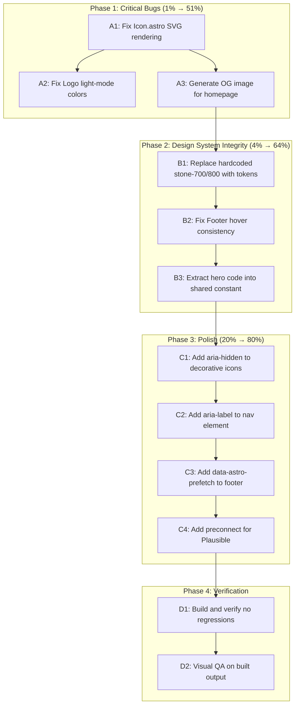

# Website Quality & Polish Plan

**Date:** 2026-05-04 09:46 CEST
**Author:** Crush (AI)
**Scope:** gogenfilter website — bug fixes, visual polish, SEO, accessibility
**Principle:** Make things BETTER, not verschlimmbessern. Fix real bugs first, then surgical improvements.

---

## Pareto Analysis

### The 1% that delivers 51% of the result (CRITICAL BUGS)

These are **broken things** that actively hurt the site right now:

1. **Icon.astro rendering is BROKEN** — `useCaseIconPaths` and `uiIconPaths` produce bare `<path>` elements with NO `<svg>` wrapper. Every UI icon (menu, close, sun, moon, github, star, arrow) and use-case icon (cog, chart, refresh, bolt, check) renders as invisible/broken HTML. Only `featureIcons` works because they include full `<svg>` tags.
2. **Logo hardcoded colors** — `Logo.astro` uses `fill="#22d3ee"` and `fill="#0c0a09"` hardcoded, so in light mode the logo stays dark-on-light = invisible/inverted.
3. **No OG image for homepage** — Landing page uses `/logo.svg` (28x28 SVG) as social sharing image. Most platforms won't render SVG OG images at all, or show a tiny icon.

### The 4% that delivers 64% of the result (HIGH IMPACT)

4. **Hardcoded Tailwind colors bypass design tokens** — `bg-stone-700`, `bg-stone-800`, `text-green-400`, `hover:text-stone-300`, `text-stone-600` used directly instead of theme tokens. Inconsistent in light mode, defeats the purpose of the design system.
5. **Footer hover colors inconsistent** — Footer uses `hover:text-stone-300` while Header uses `hover:text-text-primary`. Two different interaction patterns on same page.
6. **Hero code duplication** — Go code sample appears twice in HeroSection.astro (HTML template + clipboard JS). Must be updated in sync or they drift.

### The 20% that delivers 80% of the result (POLISH)

7. **Accessibility gaps** — Missing `aria-hidden` on decorative icons, missing `aria-label` on nav, missing accessible text for checkmarks
8. **GeneratorGrid doesn't use Card component** — Inline card markup duplicates Card.astro logic
9. **Missing `data-astro-prefetch` on footer links** — Header has it, footer doesn't
10. **No preconnect for Plausible analytics** — DNS resolution delay on first load

---

## Execution Order

---

## 27-Task Plan (30-100min each)

| #   | Task                                                                      | Impact   | Effort | Phase |
| --- | ------------------------------------------------------------------------- | -------- | ------ | ----- |
| A1  | Fix Icon.astro: wrap path-only icons in `<svg>` element                   | CRITICAL | 30min  | 1     |
| A2  | Fix Logo.astro: use CSS `currentColor` or themed fills                    | CRITICAL | 15min  | 1     |
| A3  | Generate proper OG image for homepage landing page                        | CRITICAL | 30min  | 1     |
| B1  | Replace `bg-stone-700`/`bg-stone-800`/`text-stone-600` with design tokens | HIGH     | 30min  | 2     |
| B2  | Fix Footer hover colors to use `hover:text-text-primary` like Header      | HIGH     | 15min  | 2     |
| B3  | Extract hero Go code into shared constant, use in template + clipboard    | HIGH     | 15min  | 2     |
| C1  | Add `aria-hidden="true"` to all decorative Icon.astro renders             | MED      | 15min  | 3     |
| C2  | Add `aria-label="Main navigation"` to Header nav element                  | MED      | 5min   | 3     |
| C3  | Add `data-astro-prefetch` to Footer Documentation link                    | MED      | 5min   | 3     |
| C4  | Add `<link rel="preconnect">` for plausible.io domain                     | MED      | 5min   | 3     |
| C5  | Replace `text-green-400` checkmarks with design token or accent color     | MED      | 10min  | 3     |
| C6  | Refactor GeneratorGrid to use Card component with href                    | MED      | 30min  | 3     |
| C7  | Verify copy button has `aria-label` attribute                             | MED      | 5min   | 3     |
| C8  | Ensure comparison Unicode marks have accessible alternatives              | LOW      | 15min  | 3     |
| D1  | Full build verification — `nix run .#build` passes                        | HIGH     | 15min  | 4     |
| D2  | Visual QA — inspect built HTML output for regressions                     | HIGH     | 30min  | 4     |

> Items 17-27 from original analysis intentionally EXCLUDED — they are verschlimmbesserung risks (animations, new sections, playground, etc.) that could break what works. Ship the above first, then reconsider.

---

## 15-Minute Micro-Task Breakdown (74 tasks)

### Phase 1: Critical Bugs

| #   | Micro-Task                                                                                   | File(s)                           | Time  |
| --- | -------------------------------------------------------------------------------------------- | --------------------------------- | ----- |
| 1   | Read Icon.astro, understand the 3 icon categories and their format difference                | `src/components/Icon.astro`       | 2min  |
| 2   | Refactor Icon.astro: all icon maps store only path data, wrap in `<svg>` in template         | `src/components/Icon.astro`       | 10min |
| 3   | Add `width`/`height`/`viewBox` attributes to the template `<svg>` wrapper                    | `src/components/Icon.astro`       | 3min  |
| 4   | Verify featureIcons still render correctly (they had full SVG before, now stripped)          | `src/components/Icon.astro`       | 5min  |
| 5   | Test: build and check HTML output for icon SVGs                                              | build output                      | 3min  |
| 6   | Read Logo.astro, identify hardcoded colors                                                   | `src/components/Logo.astro`       | 2min  |
| 7   | Change logo rect fill from `#22d3ee` to `currentColor` + add `class="text-accent"` on parent | `src/components/Logo.astro`       | 5min  |
| 8   | Change logo text fill from `#0c0a09` to `var(--color-bg-primary)` or a CSS variable          | `src/components/Logo.astro`       | 5min  |
| 9   | Verify logo renders in both dark and light mode                                              | visual check                      | 3min  |
| 10  | Create OG image route for homepage or add static OG PNG                                      | `src/pages/og/` or config         | 10min |
| 11  | Update LandingLayout.astro to use new OG image path instead of `/logo.svg`                   | `src/layouts/LandingLayout.astro` | 5min  |
| 12  | Verify OG meta tags in built HTML point to PNG, not SVG                                      | build output                      | 2min  |

### Phase 2: Design System Integrity

| #   | Micro-Task                                                                                       | File(s)                                  | Time |
| --- | ------------------------------------------------------------------------------------------------ | ---------------------------------------- | ---- |
| 13  | Define new design tokens: `--color-code-dot`, `--color-code-bg`, `--color-comment` in global.css | `src/styles/global.css`                  | 5min |
| 14  | Add light mode overrides for the new tokens                                                      | `src/styles/global.css`                  | 3min |
| 15  | Replace `bg-stone-700` in HeroSection code editor dots with new token                            | `src/components/HeroSection.astro`       | 3min |
| 16  | Replace `bg-stone-800/80` copy button background with new token                                  | `src/components/HeroSection.astro`       | 3min |
| 17  | Replace `text-stone-600` comment color in hero code with new token                               | `src/components/HeroSection.astro`       | 3min |
| 18  | Replace `text-green-400` JS class in copy button with accent token or semantic class             | `src/components/HeroSection.astro`       | 3min |
| 19  | Replace `bg-stone-800` in PhaseSection code blocks with new token                                | `src/components/PhaseSection.astro`      | 3min |
| 20  | Replace `text-green-400` in ComparisonSection with design token                                  | `src/components/ComparisonSection.astro` | 3min |
| 21  | Replace `hover:text-stone-300` in Footer with `hover:text-text-primary`                          | `src/components/Footer.astro`            | 3min |
| 22  | Extract Go code string into a shared constant in data layer                                      | new file or HeroSection                  | 5min |
| 23  | Import shared code constant in HeroSection template (HTML highlighted version)                   | `src/components/HeroSection.astro`       | 5min |
| 24  | Import shared code constant in HeroSection clipboard script                                      | `src/components/HeroSection.astro`       | 3min |
| 25  | Verify clipboard copy still produces correct Go source                                           | manual test                              | 2min |

### Phase 3: Accessibility & Polish

| #   | Micro-Task                                                                          | File(s)                                  | Time |
| --- | ----------------------------------------------------------------------------------- | ---------------------------------------- | ---- |
| 26  | Add `aria-hidden="true"` to Icon.astro template `<svg>` output                      | `src/components/Icon.astro`              | 3min |
| 27  | Verify this doesn't break the star icon (which is meaningful, not decorative)       | visual check                             | 2min |
| 28  | Add `aria-label="Main navigation"` to `<nav>` in Header.astro                       | `src/components/Header.astro`            | 2min |
| 29  | Add `data-astro-prefetch` to Footer Documentation link                              | `src/components/Footer.astro`            | 2min |
| 30  | Add `<link rel="preconnect" href="https://plausible.io">` to LandingLayout head     | `src/layouts/LandingLayout.astro`        | 2min |
| 31  | Add `<link rel="dns-prefetch" href="https://plausible.io">` alongside preconnect    | `src/layouts/LandingLayout.astro`        | 1min |
| 32  | Add `aria-label="Copy code to clipboard"` to copy button in HeroSection             | `src/components/HeroSection.astro`       | 2min |
| 33  | Add `checkmark` or similar for ComparisonSection marks | `src/components/ComparisonSection.astro` | 5min |

### Phase 4: Verification

| #   | Micro-Task                                                           | File(s)           | Time |
| --- | -------------------------------------------------------------------- | ----------------- | ---- |
| 34  | Run `nix run .#build` — verify 0 errors, 0 warnings                  | terminal          | 3min |
| 35  | Inspect built index.html — all SVGs render correctly                 | `dist/index.html` | 5min |
| 36  | Check OG meta tags use PNG path                                      | `dist/index.html` | 2min |
| 37  | Check Logo SVG uses theme-aware fills                                | `dist/index.html` | 2min |
| 38  | Verify no hardcoded stone-\* or green-400 in built HTML (spot check) | `dist/index.html` | 5min |
| 39  | Run `nix run .#typecheck` — verify 0 type errors                     | terminal          | 3min |

---

## What We Are NOT Doing (verschlimmbesserung risks)

These sound nice but carry high risk of making things worse:

- ❌ Animated hero code (typing effects add complexity, break with screen readers)
- ❌ Interactive playground (needs server-side logic, not appropriate for static site)
- ❌ Scroll progress bar (adds JS overhead for minimal value)
- ❌ Parallax effects (performance regression on mobile)
- ❌ Magnetic button effects (gimmick, accessibility concern)
- ❌ Background patterns/textures (can hurt readability)
- ❌ Testimonials section (no real testimonials available = fake = trust damage)
- ❌ Newsletter signup (premature for library with unknown traffic)
- ❌ Blog section (no content pipeline, maintenance burden)
- ❌ RSS feed (no blog to feed)
- ❌ Service worker / offline support (over-engineering for docs site)
- ❌ Adding new sections (FAQ, benchmarks, migration guide) before fixing what's broken

---

## Success Criteria

- [ ] All icons render as proper SVGs in built HTML output
- [ ] Logo visible in both dark and light mode
- [ ] Homepage has a proper PNG OG image
- [ ] Zero hardcoded `stone-*` or `green-*` Tailwind classes in source
- [ ] Footer and Header use identical hover patterns
- [ ] Hero code defined in ONE place
- [ ] Build passes with 0 errors, 0 warnings
- [ ] Type check passes
